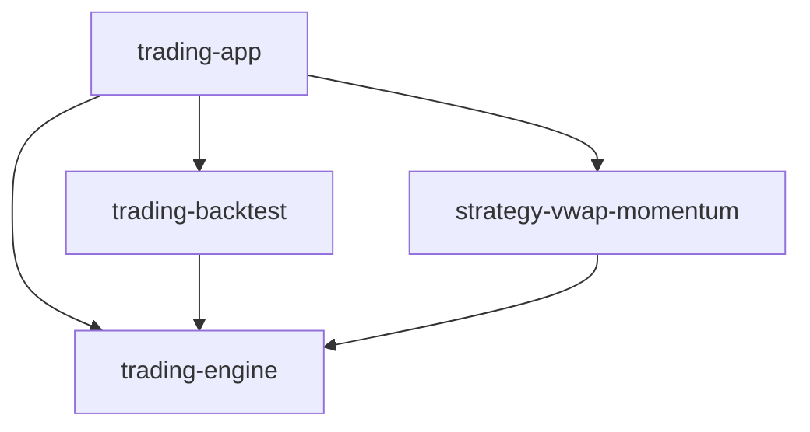

# trading-app — Reference Integrator App

> **Role**: compose `trading-engine` + `trading-backtest` + strategy plugins into a runnable Windows deployment with config, storage, reporting, and UAT tooling.  
> **Not** a fourth core library — kernel and strategy alpha live in `packages/` (monorepo).

## Dependency direction



- App **must not** be imported by any sibling package.
- App owns side effects: YAML config, tick archive, Telegram, UAT reports, param sweep orchestration.

## In scope (this repo)

| Module | Responsibility |
|--------|----------------|
| `src/integrations/` | `trading_app_engine_ports()` — telemetry, alerts, archive, trend refresh, adapter selection |
| `src/core/runtime_config.py` | `TradingAppRuntimeConfig` — YAML + env flags (`TICK_ARCHIVE`, etc.) |
| `src/live/` | `python -m live` — Shioaji + TradingEngine entry |
| `src/backtest/engine.py` | Thin wrapper injecting app ports into `trading_backtest.BacktestEngine` |
| `src/storage/` | Tick/kbar archive and loaders |
| `src/reporting/` | `uat_report`, performance metrics, trend calibration |
| `src/sweep/` | Walk-forward param sweep (research) |
| `config/config.yaml` | Strategy/runtime parameters (non-secrets) |

## Out of scope

| Concern | Owner |
|---------|-------|
| Trading state machine | `trading-engine` |
| Tick replay / MockBroker | `trading-backtest` |
| VWAP momentum alpha | `strategy-vwap-momentum` |
| PyPI publish of kernel | sibling repos |

## Public wiring API

```python
from integrations.engine_wiring import (
    trading_app_engine_ports,
    default_strategy,
    order_adapter_for,
)
from trading_engine.engine import TradingEngine

ports = trading_app_engine_ports(api=api, use_mock_adapter=False, with_alerts=True, with_archive=True)
TradingEngine(
    api=api,
    strategy=default_strategy(ports["runtime_config"], ports["obs"]),
    **{k: v for k, v in ports.items() if k != "obs"},
).start()
```

## CLI (from `src/` or `PYTHONPATH=src`)

| Command | Purpose |
|---------|---------|
| `python -m live` | Simulation or live session |
| `python -m reporting <log>` | UAT metrics from `SIGNAL_AUDIT` / `FILL_AUDIT` / `DAILY_SUMMARY` |
| `python -m storage.compress` | Post-session tick gzip |
| `python -m backtest` | App-wired backtest |

## Integration contracts

Stable interfaces between runtime, reporting, and research tooling. **Do not** change log prefixes or JSON field names without updating `reporting/uat_report.py`, determinism tests, and this section.

### Audit log (runtime → reporting)

| Prefix | Emitter | Consumer |
|--------|---------|----------|
| `SIGNAL_AUDIT {json}` | runtime on each `OrderSignal` | `uat_report.parse_log_audits_and_fills` |
| `FILL_AUDIT {json}` | runtime on each fill | `uat_report.parse_log_audits_and_fills` |
| `DAILY_SUMMARY {json}` | trading-day rollover / shutdown | `uat_report`, `param_sweep` |

**SIGNAL_AUDIT** — `core/audit/signal_audit.py` (`SignalAudit`):

- `intent`: `"entry"` \| `"exit"`
- `direction`: `"Buy"` \| `"Sell"`
- `price`, `ts`
- `vol_1s`, `buy_ratio`, `sell_ratio`
- `atr`, `multiplier`, `vol_threshold`, `vwap`
- `reason`, `trend_dir`, `trend_strength`, `trail_points_used`

Serialization: `json.dumps(asdict(audit), ensure_ascii=False, separators=(",", ":"))`

**FILL_AUDIT** — `observability.FillAudit`:

- `intent`, `direction`, `signal_price`, `fill_price`
- `slippage_pts`, `limit_price`, `slippage_vs_limit_pts`
- `order_id`, `ts`, `hold_sec`, `pnl_points`, `exit_reason`, `ioc_slippage_allowed`

**DAILY_SUMMARY** — `observability.DailyObservability.build_summary()`: near-miss stats, tick-type distribution, risk state, optional `performance` from `performance_metrics`.

**Auxiliary UAT lines** (regex-parsed): `MOMENTUM Long|Short 突破`, `tick_type 分布 | ...`, `委託未成交/已取消`.

### Sweep & determinism (research — not a UAT gate)

App-layer tooling: determinism hash gate + walk-forward param sweep (`src/sweep/`, `src/reporting/`). Strategy trend calibration semantics: [`packages/strategies/vwap-momentum/SPEC.md`](../../packages/strategies/vwap-momentum/SPEC.md) §6.1 · progress [`docs/TODO.md`](../../docs/TODO.md) §P6-1-CAL.

**Determinism** (`sweep/determinism_check.py`) — `run_hash(code, dates, cache_dir) -> str`:

- Collect `SIGNAL_AUDIT`, `FILL_AUDIT`, `DAILY_SUMMARY` JSON; normalize; SHA-256
- Hash JSON body only (no log timestamps); `sort_keys=True, separators=(",", ":")`
- Strip `DAILY_SUMMARY.operational` wall-clock fields: `lock_wait_max_ms`, `lock_wait_over_50ms`, `no_tick_resubscribe`, `atr_min`, `atr_max`
- Include `DAILY_SUMMARY` decision fields

Tests: `tests/sweep/test_determinism.py` (`test_three_runs_same_hash`, `test_three_runs_same_hash_with_kbars_and_fills`, `test_daily_summary_in_hash`, `test_hash_robust_to_key_order`, `test_hash_ignores_operational_wall_clock`, `test_uat_report_parses_backtest_log`).

**Param sweep** (`sweep/param_sweep.py`) — `sweep(grid, dates_train, dates_valid, code, cache_dir)`:

1. Patch strategy params via `StrategyParams` / config overlay
2. Train backtest → KPI; valid backtest → KPI (out-of-sample)
3. Emit `{params, train_kpi, valid_kpi, veto_metrics?}`; rank on **valid** only
4. Output: `sweep_result.jsonl`

Trend grid (CAL-3): when grid contains `trend_*` keys, attach `veto_metrics` from harness. B-class replay: `forward_policy=ForwardPnlPolicy(...)`; CLI `python -m reporting.calibration_cli ... --sweep`. `quick_stop_loss_rate` = `Σ quick_sl / Σ exits` (weighted).

Tests (`tests/sweep/test_param_sweep.py`): `test_sweep_small_grid`, `test_config_restored`, `test_daily_summary_params_match_sweep`, `test_sweep_params_affect_entry`, `test_sweep_with_trend_params_attaches_veto_metrics`. Scoring: `reporting/performance_metrics.py` survival KPIs.

| Module | Path |
|--------|------|
| Determinism | `src/sweep/determinism_check.py` |
| Param sweep | `src/sweep/param_sweep.py` |
| UAT report | `src/reporting/uat_report.py` |
| Trend harness | `src/reporting/trend_calibration.py` |
| Forward PnL replay | `src/reporting/forward_pnl.py` |
| B-class CLI | `src/reporting/calibration_cli.py` |

**Done**: same inputs → same hash (with fills); sweep restores config; `uat_report` parses backtest logs; app **81** tests green (`bash scripts/run-all-tests.sh`).

### UAT execution

[`docs/uat/KERNEL.md`](../../docs/uat/KERNEL.md) + [`docs/uat/APP.md`](../../docs/uat/APP.md)（含 Pilot Readiness Gate）。

## Install (monorepo)

From repo root:

```bash
bash scripts/setup-dev.sh
```

Or path editable only:

```bash
pip install -r apps/trading-app/requirements.txt
```

模組邊界與資料流：見本檔開頭 **In scope** 表、**Dependency direction**、§Integration contracts。依賴契約：[`packages/trading-engine/SPEC.md`](../../packages/trading-engine/SPEC.md)、[`packages/trading-backtest/SPEC.md`](../../packages/trading-backtest/SPEC.md)。

## Status

**v0.1.2** — UAT-ready reference deployment with P0/P4-13 live guards. `simulation: true` default in `config/config.yaml`. Live / Pilot requires human Go/No-Go per [`docs/uat/APP.md`](../../docs/uat/APP.md)（含量化 Pilot Readiness Gate）。