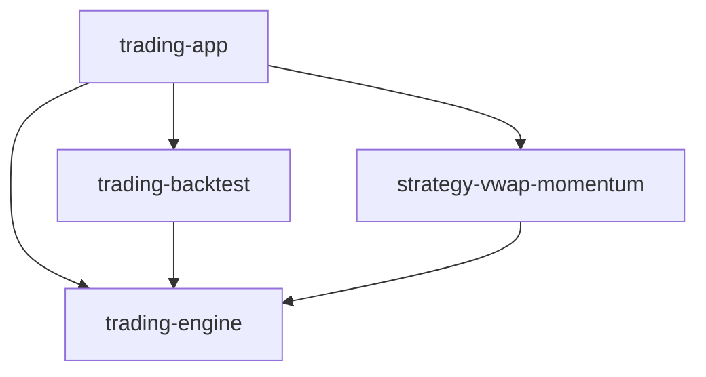

# trading-app — Reference Integrator App

> **Role**: compose `trading-engine` + `trading-backtest` + strategy plugins into a runnable Windows deployment with config, storage, reporting, and UAT tooling.  
> **Not** a fourth core library — kernel and strategy alpha live in `packages/` (monorepo).

## Dependency direction



- App **must not** be imported by any sibling package.
- App owns side effects: YAML config, tick archive, Telegram, UAT reports, param sweep orchestration.

## In scope (this repo)

| Module | Responsibility |
|--------|----------------|
| `src/integrations/` | `trading_app_engine_ports()` — telemetry, alerts, archive, trend refresh, adapter selection |
| `src/core/runtime_config.py` | `TradingAppRuntimeConfig` — YAML + env flags (`TICK_ARCHIVE`, etc.) |
| `src/live/` | `python -m live` — Shioaji + TradingEngine entry |
| `src/backtest/engine.py` | Thin wrapper injecting app ports into `trading_backtest.BacktestEngine` |
| `src/storage/` | Tick/kbar archive and loaders |
| `src/reporting/` | `uat_report`, performance metrics, trend calibration |
| `src/sweep/` | Walk-forward param sweep (research) |
| `config/config.yaml` | Strategy/runtime parameters (non-secrets) |

## Out of scope

| Concern | Owner |
|---------|-------|
| Trading state machine | `trading-engine` |
| Tick replay / MockBroker | `trading-backtest` |
| VWAP momentum alpha | `strategy-vwap-momentum` |
| PyPI publish of kernel | sibling repos |

## Public wiring API

```python
from integrations.engine_wiring import (
    trading_app_engine_ports,
    default_strategy,
    order_adapter_for,
)
from trading_engine.engine import TradingEngine

ports = trading_app_engine_ports(api=api, use_mock_adapter=False, with_alerts=True, with_archive=True)
TradingEngine(
    api=api,
    strategy=default_strategy(ports["runtime_config"], ports["obs"]),
    **{k: v for k, v in ports.items() if k != "obs"},
).start()
```

## CLI (from `src/` or `PYTHONPATH=src`)

| Command | Purpose |
|---------|---------|
| `python -m live` | Simulation or live session |
| `python -m reporting <log>` | UAT metrics from `SIGNAL_AUDIT` / `FILL_AUDIT` / `DAILY_SUMMARY` |
| `python -m storage.compress` | Post-session tick gzip |
| `python -m backtest` | App-wired backtest |

## UAT contract

Log lines consumed by `reporting/uat_report.py`:

- `SIGNAL_AUDIT {json}`
- `FILL_AUDIT {json}`
- `DAILY_SUMMARY {json}`

Emitters: `trading-engine` (kernel) + `TradingAppTelemetryPort` (app observability).  
Checklist: [`packages/trading-engine/docs/UAT_CHECKLIST.md`](../../packages/trading-engine/docs/UAT_CHECKLIST.md) (kernel) + [`docs/UAT_CHECKLIST.md`](docs/UAT_CHECKLIST.md) (app deployment).

## Install (monorepo)

From repo root:

```bash
bash scripts/setup-dev.sh
```

Or path editable only:

```bash
pip install -r apps/trading-app/requirements.txt
```

See [`SPEC.md`](../../SPEC.md) · [`docs/Architecture.md`](../../docs/Architecture.md).

## Status

**v0.1.2** — UAT-ready reference deployment with P0/P4-13 live guards. `simulation: true` default in `config/config.yaml`. Live / Pilot requires human Go/No-Go per `TODO.md` + `docs/BeforePilot.md`.