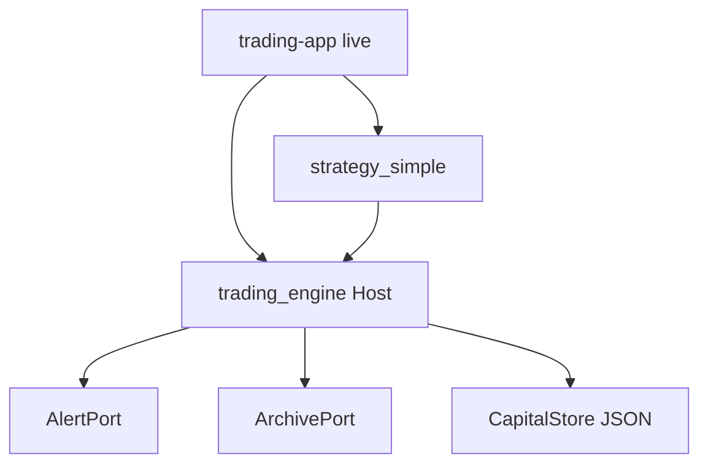

# trading-app — Product SPEC (SSOT)

> 永豐 Shioaji 台指期 **lean Host**：safety kernel（session / 資本風控 / 委託）+ storage + live。  
> Strategy = UAT flip（`strategy_simple`）。歷史研究見 [`legacy/`](../../legacy/README.md)。

本文是 **Host 架構與契約的 SSOT**。實作細節可對照 `trading_engine/`；安全失敗模式見 [`docs/ops/LIVE_SAFETY.md`](../../docs/ops/LIVE_SAFETY.md)。

---

## 架構（現況 = SSOT）

```text
                    ┌─────────────────────────────────────┐
                    │           TradingEngine              │
                    │   tick 編排 · 一把 lock · 對外 API    │
                    └──────────────────┬──────────────────┘
           ┌───────────┬───────────────┼───────────────┬────────────┐
           ▼           ▼               ▼               ▼            ▼
      ┌─────────┐ ┌──────────┐  ┌────────────┐  ┌──────────┐  ┌─────────┐
      │ Session │ │   Book   │  │CapitalRisk │  │   Link   │  │  Ticks  │
      │ 日曆/   │ │ 持倉+    │  │ 累進 MDD   │  │ 連線/    │  │ + WD    │
      │ 日切/   │ │ 在途單   │  │ + JSON 持久│  │ 重連/    │  │ methods │
      │ 強平窗  │ │          │  │            │  │ warmup   │  │ on eng  │
      └─────────┘ └────┬─────┘  └─────┬──────┘  └──────────┘  └─────────┘
                       │              │
                       │ fill PnL     │ freeze
                       └──────┬───────┘
                              │
                    ┌─────────┴─────────┐
                    │   Integrity       │
                    │ SETTLING / HALT   │
                    └─────────┬─────────┘
                              ▼
              Strategy · AlertPort · ArchivePort
              BrokerPort · OrderAdapter
```

Foundation phases **A–D complete**. Host does **not** inject observability/telemetry.

### 依賴


```mermaid
flowchart TD
  APP[trading-app live]
  TE[trading_engine Host]
  SS[strategy_simple]
  ALERT[AlertPort]
  ARCH[ArchivePort]
  CAP[CapitalStore JSON]

  APP --> TE
  APP --> SS
  SS --> TE
  TE --> ALERT
  TE --> ARCH
  TE --> CAP
```

### 職責表

| 模組 | 擁有狀態 | 做什麼 | 不做什麼 |
|------|----------|--------|----------|
| **TradingEngine** | lock、strategy、ports | `on_tick` 順序、組 `RiskGate`、`run/start` | 堆業務欄位（漸進收斂） |
| **Session** | trading_date、session windows | 日切（**僅 ops**）、force-flatten 時刻 | 持倉、MDD |
| **Book**（目標） | position + flight | 進場/出場/fill、`max_position_qty=1`、FILL_AUDIT | 連線、策略 alpha |
| **CapitalRisk** | realized / peak / frozen | 累進 MDD gate + **JSON 持久化** | 下單、部位 |
| **Link / Integrity / Watchdog** | 連線 / settle-halt / no-tick | 重連、UNKNOWN→SETTLE、告警 | 資本帳、alpha |
| **Strategy** | 策略 episode | 回 `OrderSignal \| None` | 碰 broker / 資本帳 |
| **AlertPort** | — | Telegram / CRITICAL | 決策 |
| **ArchivePort** | — | tick/kbar 落盤（可選） | 風控 |

**刻意不存在：** 大一統 `Trader`、Host 內 `TelemetryPort` / `DailyObservability`、一般化多部位 portfolio。

### 持倉與 buy/sell

本 Host 是 **max_qty=1、單向、全進全出**。持倉與在途單是同一狀態機：

```text
Flat ⇄ Flight(entry) ⇄ Long|Short ⇄ Flight(exit) ⇄ Flat
```

- **不**把部位寫進檔案；重啟後部位 **只信 broker**（`sync_positions`）。
- 資本帳（MDD）才持久化——券商不知道你的 HWM。

---

## 模組路徑

| 路徑 | 職責 |
|------|------|
| `src/trading_engine/` | Host kernel |
| `src/trading_engine/book.py` | position + flight |
| `src/trading_engine/connectivity.py` | link / reconnect |
| `src/trading_engine/integrity.py` | SETTLING / HALT |
| `src/trading_engine/ticks.py` | tick counters for watchdogs |
| `src/trading_engine/core/risk.py` | `CapitalRiskState` |
| `src/trading_engine/core/capital_store.py` | 累進資本帳 JSON 原子讀寫 |
| `src/trading_engine/core/audit/fill_audit.py` | 進出損益 FILL_AUDIT |
| `src/storage/` | tick_cache SSOT |
| `src/strategy_simple.py` | UAT flip |
| `src/live/` | `python -m live` |
| `src/integrations/` | alerts / archive / wiring（**無** live telemetry） |
| `src/observability.py` | **LEGACY** VWAP/near-miss metrics（tests only） |
| `src/integrations/telemetry_port.py` | **LEGACY** adapter（not wired live） |
| `config/config.yaml` | session + risk + ops |

策略指標（ATR、VWAP…）不在 Host（見 monorepo `legacy/`）。

---

## Wiring

```python
from strategy_simple import SimpleParams, SimpleStrategy
from integrations.engine_wiring import trading_app_engine_ports
from trading_engine.engine import TradingEngine

ports = trading_app_engine_ports(
    api=api, use_mock_adapter=False, with_alerts=True, with_archive=True
)
strategy = SimpleStrategy(SimpleParams.from_runtime_config(cfg))
TradingEngine(
    api=api,
    strategy=strategy,
    **{k: v for k, v in ports.items() if k != "live_bars"},
)
```

Host **不**注入 observability。策略觀測若需要，由策略自己 log。

---

## 資本風控（累進 MDD + 持久化）

### 語意

```text
realized_pnl  += exit_pnl          # 跨日累積
equity_peak    = max(peak, realized)
drawdown       = peak - realized
capital_frozen = drawdown >= max_mdd_points   # sticky
```

- `max_mdd_points <= 0` → **閘門關閉**（UAT 預設 **0**）：不評估、**不套用** sticky `capital_frozen`（JSON 帳本 realized/peak 仍可保留）
- `max_mdd_points > 0` 時：`entry_blocked = ops_block | capital_frozen`
- **日切不清** 資本帳；只清日內 ops（`daily_pnl` 顯示、disconnect 計數、日內 HALT…）
- 解除 sticky（在閘門開啟時）：`clear_capital_risk()` 或刪檔後重啟

### 持久化檔

```yaml
# config.yaml strategy:
max_mdd_points: 0
capital_state_path: "var/capital_risk.json"
```

```json
{
  "version": 1,
  "product_code": "TMFR1",
  "realized_pnl": -40.0,
  "equity_peak": 120.0,
  "capital_frozen": true,
  "updated_at": "..."
}
```

- 寫入：`tmp → fsync → rename`（原子）；失敗 → CRITICAL alert（記憶體仍 freeze，但重啟可能丟狀態）
- 讀：啟動時 load；缺/不符 `product_code` 則忽略；load 後若 `max_mdd>0` 且回撤已超限 → 立即 freeze
- 相對路徑：錨定 **trading-app root**（`config.resolve_capital_state_path`），不依 CWD
- 空 path：不持久化（單元測試）

### 重啟契約

```text
START
  1. load capital JSON → CapitalRisk
  2. connect broker → sync_positions → position
  3. pending/flight = empty
  4. capital_frozen AND max_mdd_points > 0 → entry blocked
     （max_mdd<=0 時 sticky 旗標可仍為 true，但不擋進場）
```

### 三種凍結

| 凍結 | 擁有者 | 跨日 | 跨重啟 |
|------|--------|------|--------|
| `capital_frozen` | CapitalRisk | 保留 | **JSON 保留** |
| `block_new_entry`（ops） | 日內 ops / integrity | 日切清 | 重啟清 |
| settle / unconfirmed | integrity | 日切可 lift | 重啟清；broker 為準 |

合成：`entry_blocked = ops_block | (max_mdd_points > 0 && capital_frozen)`（外加 settle 等執行凍結）。

### Host FILL_AUDIT

僅進出損益帳本：intent / fill / qty / pnl / realized / peak / drawdown。  
**不含** near-miss / VWAP（legacy `observability.py` 不進 live）。

### Deprecated config

`max_consecutive_loss` / `max_daily_loss_points`：**不當 capital gate**（欄位相容保留）。

---

## Sessions

日盤 `08:45–13:45`；夜盤 `15:00–05:00`（`night_enabled`）。  
TAIFEX 交易日約 15:00 切換；夜盤+次日日盤共用 **日內** 預算顯示，**不**重置累進 MDD。  
Gap 有持倉 → sticky force flatten。

---

## CLI

| Command | Purpose |
|---------|---------|
| `python -m live` | Sim / live（日+夜） |
| `python -m storage` | tick_cache helpers |
| `python -m backfilldata` | historical download |
| `python -m cli_help` | catalog |

---

## 分階段路線（Foundation）

| Phase | 內容 | 狀態 |
|-------|------|------|
| **A** | CapitalStore 持久化；live 去 observability；SPEC 架構 SSOT | **done** |
| **B** | Book 封裝（持倉+flight，`trading_engine/book.py`） | **done** |
| **C** | Link / Integrity / Tick 狀態收攏；`on_tick` 閱讀地圖 | **done** |
| **D** | SSOT 定稿、legacy 標記、deprecated 文件化 | **done** |

### Phase B notes

- `TradingEngine._book` owns position + single pending flight.
- Call sites keep `host.position_qty` / `host.is_pending` via `__getattr__` / `__setattr__` forwarders.
- Progressive capital remains on `_capital` / `CapitalStore` (not in Book).

### Phase C notes

| Object | Module | Owns |
|--------|--------|------|
| `_book` | `book.py` | position + flight |
| `_link` | `connectivity.py` | API connected, disconnect, reconnect, warmup |
| `_integrity` | `integrity.py` | SETTLING, HALT, reconcile debounce, miss CB |
| `_ticks` | `ticks.py` | last tick, type counts, no-tick streaks |
| `_capital` | `core/risk.py` | progressive MDD |

- Field access still via `self._settling` etc. (forwarders).
- Watchdog **methods** stay on engine (need alerts / resubscribe hooks); they read `_ticks` / `_link`.
- `on_tick` docstring is the hot-path reading map.

### Phase D notes

- Architecture diagram and module table match the tree above (no pending asterisks).
- `observability.py` / `integrations/telemetry_port.py` / `TelemetryPort` Protocol: **LEGACY** headers; not live-wired.
- Config keys `max_consecutive_loss` / `max_daily_loss_points`: kept for YAML compat; **not capital gates**.
- Naming: `RiskGate.block_new_entry` = **composed** entry block; raw ops latch is `Book.block_new_entry`; use `capital_frozen` + `max_mdd_points` for capital.
- Kernel detail/history: [`docs/ARCHIVE/engine/DESIGN.md`](../../docs/ARCHIVE/engine/DESIGN.md) defers to this SPEC for product SSOT.
