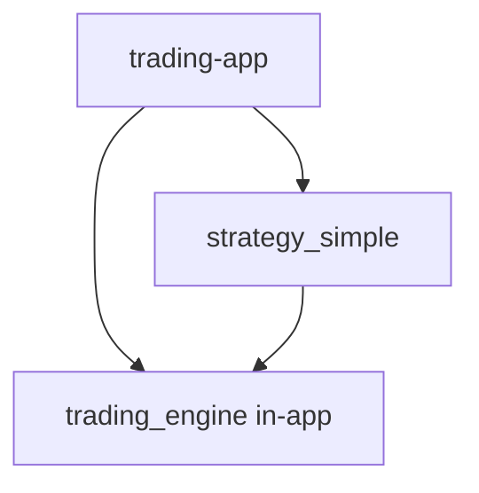

# trading-app — Product SPEC

> 永豐 Shioaji 台指期 **lean Host**：safety kernel（session / 風控 / 委託）+ storage + live；Strategy = UAT flip（`strategy_simple`）。  
> 歷史研究見 [`legacy/`](../../legacy/README.md)。

## 依賴


```mermaid
flowchart TD
  APP[trading-app]
  TE[trading_engine in-app]
  SS[strategy_simple]

  APP --> TE
  APP --> SS
  SS --> TE
```

## 模組

| 路徑 | 職責 |
|------|------|
| `src/trading_engine/` | Host：session、風控、委託、adapters（**無**策略指標） |
| `src/storage/` | tick_cache SSOT |
| `src/strategy_simple.py` | UAT flip：成交後 N 秒 flat→Buy / long→Sell；強平交 Host |
| `src/live/` | `python -m live` |
| `src/integrations/` | alerts / archive / telemetry ports |
| `config/config.yaml` | session + risk + ops（非策略 alpha） |

Host tick path owns risk / order / session / pending / flatten only. Strategy indicators (ATR, VWAP, momentum, trend, structure) live outside Host (see `legacy/`).

## Wiring

```python
from strategy_simple import SimpleParams, SimpleStrategy
from integrations.engine_wiring import trading_app_engine_ports
from trading_engine.engine import TradingEngine

ports = trading_app_engine_ports(api=api, use_mock_adapter=False, with_alerts=True, with_archive=True)
strategy = SimpleStrategy(SimpleParams.from_runtime_config(cfg), obs=obs)
TradingEngine(api=api, strategy=strategy, **{k: v for k, v in ports.items() if k != "obs"})
```

## CLI

| Command | Purpose |
|---------|---------|
| `python -m live` | Sim / live（日+夜） |
| `python -m storage` | tick_cache helpers（CSV-only） |
| `python -m backfilldata` | historical download（`date` / `month`；calendar-day AllDay） |
| `python -m cli_help` | catalog |

## 風控（Host）

- `max_consecutive_loss` → exit fill 後 `block_new_entry`（Host 執行）
- `max_daily_loss_points`：UAT flip soak **刻意不**由 Host/SimpleStrategy latch（欄位保留給日後策略）；改風控底線仍須問人
- TAIFEX 交易日 15:00 切換；夜盤+次日日盤共用預算
- Gap 有持倉 → sticky force flatten

## Sessions

日盤 `08:45–13:45`；夜盤 `15:00–05:00`（`night_enabled`）。
