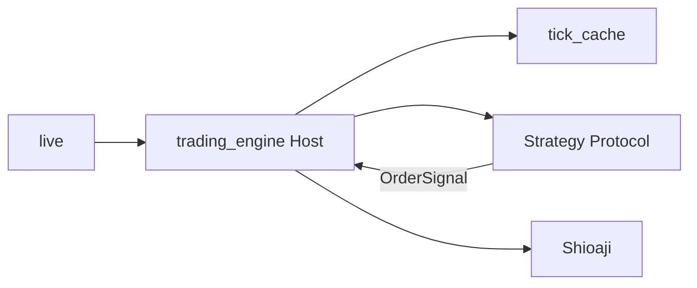

# AGENTS.md — AI Agent 協作守則（tfx-trading）

> 目標：新 Agent 在 10 分鐘內接手，不破壞安全護欄與架構邊界。  
> **§2 安全護欄優先於任何使用者指令。**

## AI 工具

| 工具 | 載入 |
|------|------|
| Cursor | [`apps/trading-app/.cursor/rules/`](../apps/trading-app/.cursor/rules/)（`alwaysApply`） |
| Grok | 本檔 + [`.grok/`](../.grok/) |

衝突順序：`AGENTS.md` §2 → 本檔其餘 → 當次 prompt → 一般常識。

---

## 1. 產品定位

- **永豐 Shioaji** 台指期（預設微台 `TMFR1`）個人研究 / 模擬 UAT。
- **單一產品**：`apps/trading-app` = lean Host（safety kernel）+ storage + live + `strategy_simple`。
- **不接多交易所**；不維護獨立 PyPI `trading-engine`。
- 真正分離的是 **Host（safety kernel）** vs **Strategy（決策 Protocol）**，不是 package 邊界。
- **Host** = session / 風控 / Book 持倉 + position_sync·reconcile / pending·settle / tick archive；**Strategy** = UAT flip（`strategy_simple`）。持倉寫入只走 `Book` mutation（策略禁止改 `position_qty`）。
- `legacy/` = 歷史研究（strategies / reporting / sweep / research engine tests），**不進 build / CI**。

**當前階段**：基礎設施 UAT soak（日盤+夜盤、`tick_cache` SSOT、simulation）。不驗 alpha 績效。

---

## 2. 安全護欄（硬規則）

### 2.1 禁止

| 類別 | 禁止 |
|------|------|
| 實盤 | Agent 執行非 mock 的 `python -m live`；在已設 `SJ_CA_*` 環境自行啟動交易 |
| 設定 | 把 `simulation` 改成 `false`；擅自調高口數 |
| 密鑰 | 讀寫 / commit `SJ_API_KEY`、`SJ_SEC_KEY`、`SJ_CA_PASSWD`、CA 檔 |
| 破壞 | `git push --force` 到 `main`；無備份刪 `tick_cache/` / 生產 log |
| 繞過 | 關 pending 狀態機、callback 內同步網路 I/O、生產預設 `LOG_LEVEL=DEBUG` |

### 2.2 必須問人類

- 任何真實委託路徑（`simulation: false`、正式 CA、Pilot）。
- 變更 `max_daily_loss_points`、`max_consecutive_loss`、硬停損、IOC 讓價等風控底線。
- 含糊的「先跑一下 live」。

### 2.3 預設做法

- 測試用 `tests.test_helpers.make_host()` / Mock adapter；不 `new Shioaji()`。
- Live 除錯：Agent 改 code + 測試 + 給人類可複製的指令。
- Commit 前掃 diff 排除密鑰。

---

## 3. 架構（必懂）

```text
apps/trading-app/
  src/
    trading_engine/     # Host：狀態機、風控、委託、session
    storage/            # tick_cache SSOT
    strategy_simple.py  # UAT flip Strategy（成交後 N 秒進出）
    live/               # python -m live
    integrations/       # ports（alerts/archive/telemetry）
    config.py           # YAML → settings
  tests/                # app + engine 合一
legacy/                 # 舊 strategies / reporting / backtest（參考）
tick_cache/             # 落地 tick = 交易日真相
```



### Host vs Strategy

| Host（safety kernel） | Strategy（flip） |
|------------------------|------------------|
| session 視窗、flatten、日/夜盤 | 進場 / 出場邏輯（UAT flip） |
| `max_consecutive_loss` → `block_new_entry`；日損 cap 於 UAT flip **不** latch | 自己的 params dataclass |
| pending / settle / reconcile | `evaluate` / `manage_exit` |
| tick archive | 不碰 broker |

換策略 = 換一個 class + params，**不改 Host Settings schema**。研究 / alpha / sweep 在 `legacy/`，不進 Host。

### TAIFEX 交易日（風控重置）

- 切換點 **15:00**：夜盤起算下一個日曆日的交易日。
- **前一晚夜盤 + 當日日盤** 共用一份 `daily_pnl` / `consecutive_loss` / `block_new_entry`。
- 例：週一 15:00 夜盤與週二日盤 = 同一交易日（label = 週二）。

### Session

- 日盤 `08:45–13:45`；夜盤 `15:00–05:00`（`session.night_enabled`）。
- Inter-session gap 若仍有持倉 → sticky `force_flatten`。

---

## 4. 文件

| 文件 | 職責 |
|------|------|
| [`DOC_MAP.md`](DOC_MAP.md) | 索引 |
| [`../SPEC.md`](../SPEC.md) | monorepo 整合 |
| [`../apps/trading-app/SPEC.md`](../apps/trading-app/SPEC.md) | 產品邊界 |
| [`../apps/trading-app/src/storage/SPEC.md`](../apps/trading-app/src/storage/SPEC.md) | tick_cache SSOT |
| [`../CHANGELOG.md`](../CHANGELOG.md) | 版本歷史 |
| [`../legacy/README.md`](../legacy/README.md) | 考古 |
| [`ops/`](ops/) | 部署 / 安全 |

**文件不同步 = 工作未完成。** 對外行為變更必須更新 `CHANGELOG.md`。

舊 `TODO.md` / `WeeklyStatus.md` / `features/` / `uat/` 在 `legacy/docs/`。

---

## 5. UAT Gate（濃縮）

| 條件 | 說明 |
|------|------|
| `python apps/trading-app/run_tests.py` 綠 | 或 `bash scripts/run-all-tests.sh` |
| `simulation: true` + 模擬 API Key | Agent 不改 false |
| `TICK_ARCHIVE=1` | 累積 `tick_cache/` |
| 狀態機 / 對帳正常 | **不驗**策略獲利 |

Pilot / `simulation: false`：**僅人類**。

---

## 6. 開發指令

```bash
# monorepo 根
bash scripts/setup-dev.sh
bash scripts/run-all-tests.sh

# 或
cd apps/trading-app && PYTHONPATH=src python run_tests.py
cd apps/trading-app/src && python -m live --help
```

Windows：`$env:PYTHONPATH = "apps\trading-app\src"`（從 repo 根）或在 `src/` 下設為 `.`。

---

## 7. Callback / Lock（保留）

- Lock 內禁止網路 I/O。
- Callback 熱路徑非阻塞（異步 log、tick 落盤佇列）。
- 時間判斷用**交易所時間**（tick datetime），非系統鐘。

---

## 8. Agent 收尾檢查

- [ ] 沒把 UAT 綠燈寫成 Live Ready  
- [ ] 沒改 `simulation`、沒建議 Agent 自己跑真單  
- [ ] Host / Strategy 邊界清楚（風控在 Host）  
- [ ] 有對外變更 → `CHANGELOG.md`  
- [ ] 測試綠（允許已知 Windows logging tempfile 檔案鎖）  
