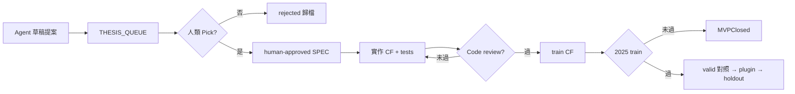

# Alpha 研究儀式（Playbook）

> **SSOT**：新策略 thesis 從提案到 MVPClosed / Holdout 的**固定流程**。  
> **雙軌**：UAT 持續 = 工程線；本檔只管 **Alpha 線**。敘事總覽：[`strategy_diagnosis.md`](../../../workspaces/strategy_diagnosis.md) §8。  
> **Gate 數字**：[`HOLDOUT_CONTRACT_v2.md`](HOLDOUT_CONTRACT_v2.md)（v2.1：2025 train · 2026 Q1 valid · 2026 Q2 holdout）。

---

## 1. 人類 vs Agent（誰做什麼）

| 步驟 | 人類（Tim） | Agent |
|------|-------------|--------|
| **Thesis 來源** | **Pick / Reject / 改寫** 一個提案；寫 §Decision 簽名 | **可**從診斷產出 **2–3 份草稿** 放入 [`THESIS_QUEUE.md`](../../../workspaces/THESIS_QUEUE.md) |
| **Pre-register** | **Must 批准** grid 邊界與進出定義後，才准實作 CF | 撰寫 `SPEC.md` 草稿、撞車檢查（對照 §4 負面圖書館） |
| **CF 程式** | **Code review 通過**（Bugbot 或人類）後才准跑 train | 實作 `*_counterfactual.py` + 單元測試；**禁止**未審查即跑 2025 train |
| **Phase 0 train** | 看 `gate_report.md`、決定 Go / MVPClosed | 跑 train JSON + funnel（`cache_audit` 見 §2 快取政策） |
| **Plugin** | train 過 + 人類 Go 才開工 | 實作 `packages/strategies/...` |
| **Holdout** | **一次**封印後簽 Go / No-Go | 跑 baseline、不得依結果改參 |
| **Pilot / UAT 換策略** | 書面 Go | **禁止**自行建議 `simulation: false` |

### 1.1 Agent 能自己出 thesis 嗎？

**能出「提案」；不能自己開跑。**

- Agent 的強項：讀遍 `strategy_diagnosis`、`gate_report`、funnel，**系統性避開已死路徑**，產出可 falsify 的假說草稿。
- Agent 的弱項：沒有你的盤感與風險偏好；回測外推 ≠ 真實 queue；容易在已知族內變形（ORB+1 條件）而非新 thesis。
- **規則**：任何 CF / 程式碼之前，queue 裡該列狀態 MUST 為 **`human-approved`**，且 `docs/features/<slug>/SPEC.md` 頂部 `owner` 含人類簽核日期。



**實務建議（知識差距大時）**

1. 對 Agent 說：「依 Playbook §4 負面圖書館，提案 3 個**本質不同**的 thesis 草稿進 queue。」
2. 你只回答：**選哪一個 / 哪個要改 / 全部否決**。
3. 否決也要寫一行原因 → 下次提案會避開。

---

## 2. 固定儀式（每個 FT-012+ 重複）

### Phase −1 — 提案（queue）

- [ ] Agent 或人類填 [`THESIS_BRIEF.md`](../_template/THESIS_BRIEF.md)（可併入 SPEC §1–§3）
- [ ] 更新 [`THESIS_QUEUE.md`](../../../workspaces/THESIS_QUEUE.md) 一列
- [ ] **撞車檢查**：與 §4 負面圖書館 + §8.2 策略表；寫明「不是 FT-00x 因為…」
- [ ] 人類狀態 → **`human-approved`**

### Phase 0 — Counterfactual only（主戰場）

分 **三步**；**不可**跳過 code review 直接跑 train（帶 bug 的 CF 會污染 gate 結論）。

#### Phase 0a — 實作（不得跑 train）

- [ ] `reporting/<slug>_counterfactual.py` + `scripts/ftNNN_*_counterfactual.py`
- [ ] `tests/reporting/test_<slug>_counterfactual.py`（觸發邏輯、邊界、與 SPEC 對齊的最小案例）
- [ ] SPEC §3 進出規則與程式 **逐條對照**（可在 PR / review 備註）

#### Phase 0b — Code review（**MUST 先於 train**）

- [ ] 跑 **Bugbot**（或人類 review）審 `*_counterfactual.py` + tests
- [ ] 修正：lookahead、session 窗、funnel 階段、方向/ORB 比較語意、ATR 地板等
- [ ] Review **PASS** 後才可進 0c（在 `gate_report.md` 或 PR 註明 review 日期）

> **教訓**：FT-009 ORB delta、FT-011 SCB funnel 等均在 review 後才發現邏輯偏差；若先跑 train，會浪費數小時並產生錯誤 gate 敘事。

#### Phase 0c — Train 回測（review 通過後）

**tick_cache 稽核（非每次 CF）**

- SSOT 最近一次 PASS：[`workspaces/CACHE_AUDIT.md`](../../../workspaces/CACHE_AUDIT.md)
- **預設跳過**全庫 `cache_audit`（已 PASS 且未 backfill 新日）
- **MUST 重跑**：backfill 新日期、`cache_repair --fix`、首次環境 — 用增量即可：

```bash
cd apps/trading-app/src
python -m storage.cache_audit --code TMFR1 --from-date 2026-06-01 --to-date 2026-06-30
```

PASS 後更新 `CACHE_AUDIT.md` stamp。

**產物**（`workspaces/<slug>-baseline/`）

| 檔案 | 內容 |
|------|------|
| `gate_report.md` | train G1–G3、§3.1 disqualify、valid 對照、決策 |
| `reports/counterfactual_*_train.json` | 參數 grid、Long/Short、單月 |
| funnel / delta | 事件數、瓶頸階段 |
| **`post_entry_diagnosis`** | W5/W15/W30 stop-less + MFE/MAE + Long/Short（**非 gate**） |

**進場後診斷（FT-012+ MUST）**

- 模組：[`post_entry_diagnosis.py`](../../../apps/trading-app/src/reporting/post_entry_diagnosis.py)
- 每個 `*_counterfactual.py` 產物 JSON 含 `post_entry_diagnosis_by_*`；`gate_report.md` 附錄一表
- **不進** G1–G3；用來區分「方向錯」vs「出場殺 edge」；**禁止**依診斷回頭 tune train grid

**規則**

- Grid **僅** tune `2025-01-01`～`2025-12-31`
- **未過 train** → `MVPClosed`，**不寫 plugin**
- valid 只標 `overfit_suspect`，不作 Phase 0 過關依據

### Phase 1 — Plugin（train 過關 + 人類 Go）

- [ ] `packages/strategies/<name>/`
- [ ] `workspaces/<slug>-baseline/config/` + baseline replay
- [ ] valid Q1 JSON（診斷）

### Phase 2 — Holdout（valid 無重大 overfit 旗標 + 人類 Go）

- [ ] **一次**跑 `2026-04-01`～`2026-06-30`（06 未齊可標 `holdout_partial`，補齊後合併重判）
- [ ] 更新 SPEC §Decision
- [ ] 仍 **不** 自動換 UAT plugin

### Phase 3 — Confirm（可與 UAT 並行）

- [ ] 2026-07+ UAT tick：shadow / paper 對照回測決策路徑
- [ ] fill 分析；**不取代** train/holdout gate

---

## 3. Train 過關線（摘要）

完整定義：[`HOLDOUT_CONTRACT_v2.md`](HOLDOUT_CONTRACT_v2.md) **v2.2.1** §2.2 · §3–§5。

| Class | Train 2025 | 未過 → |
|-------|------------|--------|
| **mean_robust**（預設） | G1 gross>5 · G2 net>0 · G3 n≥30 · §3.1 | MVPClosed |
| **skew**（v2.2.1） | G1–G2 同左 · **G3S n≥15** · **§3.2** G-SK1–SK5 · valid net≤0 **禁 holdout** | MVPClosed / disqualify |

**共用**：holdout 封印 **不**放寬；G1/G2 **不**放寬（mean 仍須壓過 5 點摩擦）。

**設計日檢**：mean_robust 粗算 n≥30；skew 粗算 n≥15 且寫清 payoff 故事。**禁止**用 skew 標籤復活 MVPClosed FT（§11）。

---

## 4. 負面圖書館（禁止變形重跑）

| 家族 | FT | 結論 | 禁止 |
|------|-----|------|------|
| 爆量 + VWAP 回踩 hybrid | 003 | `grid_no_viable_solution` | sweep / round2 / 濾網拯救 |
| Breakout 延續 | 004, 005 | No-Go | armed/timeout 全進、追價 |
| VWAP stretch fade | 006, **012** | valid 過 / holdout 掛 / regime+早盤仍負 | **z-score fade 整族**（含 regime、時段、vol 濾網） |
| Flow / 衰竭 | 007 | 放棄 | 微結構高頻 |
| Short / 開盤突破 | 008 | MVPClosed | 同族變體 |
| ORB | 009 | 2025 train 全負 | 無新編號 ORB 掃參 |
| VWAP pullback | 010 | n≪30 | 低頻 pullback |
| Session confluence | 011 | train 負 | SCB/OR 堆條件 |
| Trend / SMC 濾網 | 002 | 放棄 | CAL-8、filter on |

SSOT 合成：[`strategy_diagnosis.md`](../../../workspaces/strategy_diagnosis.md) §6–§8.2 · 各 `workspaces/*/gate_report.md`。

---

## 5. 新 thesis 必須回答（THESIS_BRIEF）

見 [`docs/features/_template/THESIS_BRIEF.md`](../_template/THESIS_BRIEF.md)。摘要：

1. **錯價故事**：誰、何時、為何會 revert / continue？
2. **與上表本質差異**（一句話）
3. **時段 / 方向**（Long-only?）
4. **進場觸發**（可觀測、可程式化）
5. **出場**（**ATR-scaled** stop/TP/trail，寫 k 範圍）
6. **預期頻率 & gross/趟**（能否壓過 5 點摩擦）
7. **Pre-register grid**（僅 train 用）

### 5.1 Agent 提案檢查清單（避免 FT-012 重犯）

1. **機制多樣性**：queue 同批 3 案 MUST 含 ≥2 種 `E.2` 標籤（不可全 mean-reversion fade）
2. **粗算錨點**：`THESIS_BRIEF §E.1` 必填最近同族 MVPClosed 實績；預期 gross 不得無根據樂觀
3. **本質差異一句話**：必須寫清「進場觸發信號」與負面圖書館不同，非僅時段/regime 濾網
4. **Post-entry 預判**：若 thesis 是 fade，註明「若 W30 stop-less median 仍 < 摩擦 → 整族放棄，不調 exit」
5. **人類 Pick 前**：Agent 自評每案 `collision_risk: low|med|high`；high 預設不進 queue 或標 `draft-hold`
6. **Thesis class**：低頻厚尾 MUST 標 `skew` + THESIS_BRIEF §E.3；其餘預設 `mean_robust`（v2.2）

---

## 6. 開新 ft 的檔案 SOP

1. 人類批准 queue 列 → 指定 `FT-012` slug
2. 複製 [`docs/features/_template/`](../_template/) → `docs/features/<slug>/`
3. 合併 THESIS_BRIEF → `SPEC.md`
4. 更新 [`features/README.md`](../README.md) · [`DOC_MAP.md`](../../DOC_MAP.md) · [`TODO.md`](../../TODO.md)
5. Phase 0 結束 → `CHANGELOG.md` + `gate_report.md`

---

## 7. 給 Agent 的開工 prompt（複製用）

```text
讀 ALPHA_RESEARCH_PLAYBOOK.md + strategy_diagnosis §8 + HOLDOUT_CONTRACT_v2 §2.1–§2.2。
任務：<proposal-id> 已 human-approved → 寫 SPEC/PLAN + Phase 0a 實作 CF + tests。
MUST：SPEC 宣告 thesis_class（mean_robust | skew）；skew 須 §E.3 pre-register。
MUST：Phase 0b code review PASS 後才跑 0c train。
MUST NOT：每次 CF 前全庫 cache_audit（見 CACHE_AUDIT.md；僅 backfill/修復後增量掃）。
MUST：grid 僅 2025 train；產 gate_report + funnel + Long/Short + **post_entry_diagnosis 附錄**。
MUST NOT：未 review 即 train、plugin、valid tune、重跑負面圖書館家族。
```

---

## 8. 給人類的每週 15 分鐘

1. 看 [`THESIS_QUEUE.md`](../../../workspaces/THESIS_QUEUE.md) — Pick / Reject / 改
2. 若有 CF 跑完 — 只看 `gate_report.md` 第一頁決策表
3. UAT 照跑；**不因 alpha 進度改 UAT 設定**

---

## 參考

- Holdout：[`HOLDOUT_CONTRACT_v2.md`](HOLDOUT_CONTRACT_v2.md)
- 診斷：[`strategy_diagnosis.md`](../../../workspaces/strategy_diagnosis.md)
- 提案佇列：[`THESIS_QUEUE.md`](../../../workspaces/THESIS_QUEUE.md)
- 模板：[`THESIS_BRIEF.md`](../_template/THESIS_BRIEF.md)
