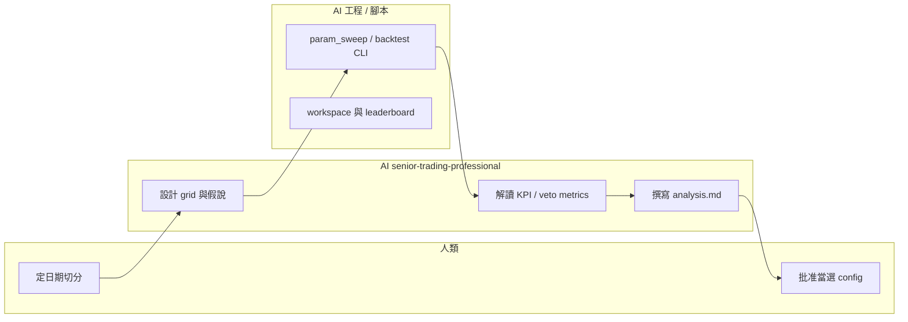

# FT-003 — AI 輔助回測調參（SPEC）

> **SPEC** = 這張 ft 要交付什麼。  
> **定位**：**績效研究支線**（backtest + sweep + AI 解讀），與 **UAT 驗收支線**並行、互不阻塞。

## 1. Summary

在 **UAT Phase 1 通過前**，`config/config.yaml` **凍結預設參數**，僅用於驗狀態機與對帳。  
同一時間，以已補齊的 **tick_cache（2026-01～2026-05）** 在回測支線上探索參數空間、結合 AI agent 競賽調參，並在 **holdout** 上選出一份 **候選 config**。

**UAT Phase 1 通過後**，人類可將候選 config 套用到 UAT / Pilot（須走 CAL-8 與 Phase 6 旗標規則）；**不得**在 UAT 未通過前因回測績效而改動 UAT 機上的 live 設定。

| 支線 | 目的 | 時間窗 | 參數 |
|------|------|--------|------|
| **UAT** | 狀態機、對帳、tick 落盤 | 交易日 08:30–14:00（GCP 排程） | **凍結**預設，至 Phase 1 Pass |
| **Backtest 研究** | 績效探索、調參、AI 競賽 | **7×24**（地端或 GCE） | 各 agent **獨立** `config.yaml` |

**AI 角色（MUST）**：見 [`AGENT_ROSTER.md`](AGENT_ROSTER.md) + [`senior-trading-professional.md`](../../../prompts/roles/senior-trading-professional.md)。每位 agent 有固定**職稱、假說、允許 tune 的 keys**；交易結論須五段式輸出。

## 2. 現況 vs 目標

| 面向 | 現況（2026-06-26） | 目標（本 SPEC） |
|------|-------------------|-----------------|
| tick 樣本 | 2026-01～05 已到位（97 交易日；見 [`workspaces/DATA_SPLIT.md`](../../../workspaces/DATA_SPLIT.md)） | train Jan–Mar / valid Apr / holdout May 切分 |
| UAT | Phase 1 進行中；參數凍結 | 不因回測中途改 UAT config |
| 調參工具 | `param_sweep`、`calibration_cli`、`-m backtest --report` | 標準化 **workspace + 競賽規則 + leaderboard** |
| AI 參與 | 零散對話 | **多 agent 競賽**（不同 search space + 統一評分） |
| 產出 | 無正式「當選 config」 | `elected_config.yaml` + 簡短選舉報告（含 overfitting 聲明） |
| Live 對齊 | MockBroker 啟發式撮合 | UAT log 可用時以 `compare_fill_audits` 校準滑價假設 |

## 3. Live vs Backtest：什麼等價、什麼不等價

**同一份 tick_cache** 下，UAT live、backtest replay 共用 **`TradingEngine` + 同一 strategy plugin** — 決策路徑（signal、veto、pending、flatten、風控 gate）**高度一致**。

**績效數字不可直接等同**（見 [`packages/trading-backtest/SPEC.md`](../../../packages/trading-backtest/SPEC.md) §9）：

| 可轉移 | 不可直接轉移 |
|--------|----------------|
| 策略狀態機與 audit 語意 | next-tick close 撮合 vs 真實 queue |
| Session / flatten / 日虧停新進場 | 部分成交、延遲 jitter |
| 確定性 regression（固定輸入） | 固定 tier 滑價 vs 券商實際 fill |
| | MockBroker 滑價 tier | 手續費 / 稅（**5 點/趟** net；[`SHARED_ASSUMPTIONS.md`](../../../workspaces/SHARED_ASSUMPTIONS.md) §3.1） |

**交易員視角（senior-trading-professional MUST 提及）**：回測 KPI 用於 **相對排序** 與 **假說驗證**，不是 live 獲利預測。Pilot 仍以券商帳戶與 UAT fill audit 為準。

## 4. Overfitting 協議（硬規則）

調參與 AI 競賽 **MUST** 遵守下列切分；違反的 run **不得** 進入 leaderboard 或「當選 config」。

### 4.1 日期切分（2026-01～06 · 見 HOLDOUT v2）

> **策略 thesis（FT-004+）完整門檻**：[`HOLDOUT_CONTRACT_v2.md`](HOLDOUT_CONTRACT_v2.md)（train 01–03 / valid 04 / holdout **05–06 合併** / 冠軍 median·方向規則）。

| 區間 | 建議月份 | 用途 |
|------|----------|------|
| **Train** | 2026-01、02、03 | Grid search、`param_sweep` 內 in-sample 觀察 |
| **Valid** | 2026-04 | **唯一** 用於 agent 競賽排名與迭代 |
| **Holdout** | 2026-05、**06** | **封印**（v2：**兩月合併**評估；單月僅參考） |
| **WFO 歷史** | 2025-01～12 | backfill 後滾動穩健性（**禁止**事後 tune 已結案 thesis） |

```text
Jan Feb Mar  →  train
Apr          →  valid
May Jun      →  holdout （v2 合併；06 落地後啟用）
2025         →  WFO only
```

### 4.2 其他防過擬合

- **參數數量**：單次 grid 自由度宜少；優先 2～4 個 knob，勿同時 tune 全表。
- **互斥 regime**：`structure_filter_enabled` 與 `trend_filter_enabled` 不可同時為 true（`param_sweep` 會 skip）。
- **確定性**：每個 workspace 在首次 sweep 前跑 `python -m sweep.determinism_check --date <任一交易日> --mode hash`。
- **資料品質**：sweep 前 `python -m storage.cache_audit --code TMFR1`；FAIL 先修再 tune。
- **AI 不得**：在 holdout 結果出來前，根據「猜測 May 會怎樣」調 valid 策略；不得把五個月全當 train 選最佳。
- **當選門檻**：valid 贏家還須 holdout **不崩潰**（MDD、秒停損率、expectancy 方向一致）；否則標記 **overfit suspect**，退回重搜。

### 4.3 評分（與程式一致）

預設 composite score 來自 `sweep_score_from_kpi`（[`performance_metrics.py`](../../../apps/trading-app/src/reporting/performance_metrics.py)），由 `config.yaml` → `performance` 區塊驅動：

| 設定鍵 | 預設 | 說明 |
|--------|------|------|
| `sweep_score_metric` | `expectancy_net` | 亦可 `sharpe_net`、`pnl_net` |
| `sweep_dd_penalty` | `0.0` | MDD 懲罰係數 |
| `sweep_sl_penalty` | `50.0` | quick_stop_loss_rate 懲罰 |

**競賽 primary metric** = **valid** 區間的 `valid_score`（`param_sweep` 已僅用 valid 排名）。Train KPI 僅供診斷。

### 4.4 算力與迭代預算（防無窮演算）

FT-003 **MUST** 遵守下列上限；違反者 `param_sweep` / `backtest` **程式拒絕執行**，或 leaderboard 不得採計。

| 項目 | 上限 | 強制方式 |
|------|------|----------|
| 單次 grid **keys** | ≤ **4** | `param_sweep.sweep` raise |
| 單次 grid **combo 數**（笛卡爾積） | ≤ **36** | `param_sweep.sweep` raise |
| Holdout（2026-05）日期 | Phase 4 前 **0 次** | `holdout_guard`（`sweep` / `backtest` / `overlay_smoke`）；解封僅 `FT003_HOLDOUT_UNSEAL=1` |
| 每 agent **sweep 輪次**（MVP） | **1 輪** | 流程：第二輪須人類書面批准；`leaderboard.jsonl` 每 agent 只採計**第一筆** `valid_submitted` |
| 每 agent **session 交付** | baseline 1 + sweep 1 + analysis 1 | ROSTER checklist；**禁止**同 session 內「看了 valid 再改 grid 再 sweep」 |
| Holdout 回測 | Phase 4 **各候選 1 次** | 人類觸發；不得 loop |

**AI token 節省（MUST）**：

- 不得把完整 `sweep_result.jsonl` 貼進 chat；只解讀 Top-3 + 最差 1 組。
- 完成 Phase 3 checklist 後 **結束 session**；下一輪調參開新 session 且須人類批准。
- 探索性全段回測（1～5 月）若執行，**不得**用於選參或寫 leaderboard。

```text
MVP 每 agent 算力預算（約）：
  baseline(valid Apr)     =  1 × 20 日 replay
  sweep(9 combo)          =  9 × (train 57 日 + valid 20 日) ≈ 693 日 replay
  holdout（Phase 4 一次）  =  1 × 20 日 replay（僅冠軍）
```

### 4.5 長歷史驗證（Post-MVP，Phase 6）

2022+ tick 樣本用於 **跨年穩健性關卡**（在 `elected_config` 之後），不取代 MVP 切分。硬規則：

- 探索性全段回測 **不得** 用於選參或 leaderboard。
- Phase 6 封印 holdout **解封前 0 次**；**不得**用 fold 結果取代 MVP 2026-05 holdout。
- 跨商品（TMFR1 vs MXF/TXF）產物標 **邏輯穩健性**，不得直接當微台 `elected_config` v2。
- Phase 6 批次回測 **MUST** 在 **GCE 盤後 / overnight**（08:30–14:00 留給 UAT）。
- **多段滾動 WFO**（季滾 pilot、月滾完整版）；**禁止**單次 train/valid 即宣稱穩健。
- **淨摩擦 MUST**：`friction.enabled: true`（SHARED_ASSUMPTIONS §3.1，5 點/趟）；Walk-forward Gate 須人類簽核 Sharpe / MDD / trade_count 穩定。
- 產物：`robustness_report.md`（§7–§10 擾動 / 市況 / 壓力 / 相關性；非第二 leaderboard）。
- **Phase 6.5**：Shadow/Paper ≥2–4 週 + backtest vs paper fill 對照 — **不可只在 backtest 收工**。
- **運維**：kill switch / emergency flatten 演練、日週報、券商 reconciliation、`max_position_qty: 1` 硬限制（見 PLAN）。

詳見 **[`PLAN.md`](PLAN.md) Phase 6 / 6.5**（Gate、四風險、v1/v2 決策樹、算力 SOP）。

### 4.6 市場尺度診斷（Phase 3.6）

在 **四位 agent Phase 3 sweep 全部完成** 後執行；用於解釋固定點數停損與波動 regime 是否脫節。**硬規則**：

- 產出 **禁止** 用於本輪 `leaderboard` 排名或修改已提交 `params`。
- 2026-05 統計 **僅** 供 holdout **風險敘事**；**禁止** 依 5 月分布回頭改本輪 grid。
- 診斷腳本 **MUST NOT** 輸出「建議參數」供直接寫入 config（描述統計與 ratio 除外）。
- 第二輪 sweep 仍須 SPEC §4.4 人類書面批准。
- 產物：`workspaces/VOLATILITY_BASELINE.md`（§A–§D 四平面）、`workspaces/strategy_diagnosis.md`；機器可讀 `workspaces/reports/volatility_baseline.json`、`workspaces/reports/entry_funnel.json`（§C，script pending）。
- 進場漏斗（§C）操作定義、cohort、固定 Δt、解讀邊界 → **[`ENTRY_FUNNEL_METRICS.md`](ENTRY_FUNNEL_METRICS.md)**（Methods SSOT）。

執行步驟、指標清單、Gate、第二輪提案 → **[`PLAN.md`](PLAN.md) Phase 3.6**。

## 5. Multi-Agent 競賽契約

> **Agent 編制、職稱、假說、grid 邊界、copy-paste 開工 prompt**：[`AGENT_ROSTER.md`](AGENT_ROSTER.md)（**AI 必讀 SSOT**）。

### 5.1 競賽編制（4 職，MVP 先 2 職）

| # | Slug | 職稱 | MVP |
|---|------|------|-----|
| 1 | `agent-conservative` | 資本保全調參師 | 必跑 |
| 2 | `agent-execution` | 執行品質調參師 | 必跑 |
| 3 | `agent-risk-exit` | 出場與風控調參師 | 擴充 |
| 4 | `agent-regime` | 市況濾網研究員 | 擴充 |

每位 agent **必須**以 [`senior-trading-professional.md`](../../../prompts/roles/senior-trading-professional.md) 身份執行；禁止「全能 agent」一次 tune 全表。

### 5.2 每 agent 交付物

| 檔案 | 說明 |
|------|------|
| `config/config.yaml` | 從 repo 預設 fork；**僅改 strategy / performance 研究項** |
| `grid.json` | sweep 笛卡爾 grid（keys → value lists） |
| `sweep_result.jsonl` | `param_sweep` 輸出 |
| `reports/` | `backtest_*.json`、必要時 full-month `--report` |
| `logs/` | `backtest_*.log` |
| `analysis.md` | 五段式（見 [`_template/analysis.md`](../../../workspaces/_template/analysis.md)）；**空白必填 = Phase 3 未完成** |
| `peer_review_*.md` | Phase 3.4 交叉審核（MVP 必做，見 ROSTER §1.6） |

### 5.3 Leaderboard

Monorepo 根或 GCE 上單一檔：

`workspaces/leaderboard.jsonl` — 每行一筆 JSON：

```json
{
  "agent": "conservative",
  "valid_score": 12.34,
  "valid_kpi": {"daily_pnl_points": 80.0, "quick_stop_loss_rate": 0.05, "trade_count": 24},
  "params": {"entry_band_points": 2.0, "min_atr_threshold": 28},
  "holdout_score": null,
  "status": "valid_leader",
  "ts": "2026-06-26T10:00:00+08:00"
}
```

Holdout 跑完後填入 `holdout_score`；`status` 可為 `valid_submitted` | `valid_leader` | `holdout_pass` | `overfit_suspect` | `insufficient_sample` | `rejected`.

**入榜門檻**：`valid_kpi.trade_count`（valid 區間 exit 總數，來自 `param_sweep` KPI）**MUST ≥ 20** 才可標 `valid_leader`；樣本不足用 `insufficient_sample`。

**每 agent 一筆**：MVP 每 workspace 在 `leaderboard.jsonl` 只保留**第一筆** `valid_submitted` 作為競賽正式提交；後續 append 須標 `status: rejected` 並註明「第二輪未批准」（見 SPEC §4.4）。

### 5.4 AI 與人類分工



- **AI 擅長**：假說、grid 設計、解讀 `veto_metrics` / `structure_veto_metrics`、撰寫失敗原因。
- **AI 不擅長（勿外包）**：用五個月 in-sample 「腦補」最佳參數、忽略 §9 fidelity、將 valid 贏家直接等同 Pilot Ready。
- **程式 MUST 跑 sweep**：避免純手改 yaml 迴圈；AI 改 `grid.json` + 解讀 `sweep_result.jsonl`。

## 6. Workspace 隔離（不必 Docker MVP）

**一份 monorepo + 一份 tick_cache（唯讀）+ 多個 workspace 目錄** 即可；`CONFIG_PATH` 已支援 per-run 設定。

```text
{MONOREPO_ROOT}/
├── tick_cache/              # 共享唯讀；勿 per-agent 複製
├── apps/trading-app/config/config.yaml   # UAT 凍結預設（勿在研究中覆寫）
└── workspaces/
    ├── leaderboard.jsonl
    ├── _template/
    │   ├── config/config.yaml
    │   └── grid.json.example
    ├── agent-conservative/
    │   ├── config/config.yaml
    │   ├── grid.json
    │   ├── logs/
    │   ├── reports/
    │   ├── sweep_result.jsonl
    │   └── analysis.md
    └── agent-execution/
        └── ...
```

環境變數（每 agent run）：

| 變數 | 範例 |
|------|------|
| `CONFIG_PATH` | `{MONOREPO}/workspaces/agent-conservative/config/config.yaml` |
| `LOG_FILE` | `{MONOREPO}/workspaces/agent-conservative/logs/run_001.log` |
| `PYTHONPATH` | `{MONOREPO}/apps/trading-app/src` |

GCE（[`LinuxOps.md`](../../ops/LinuxOps.md)）：`e2-medium` 建議 **同時只跑 1 個** 全月 replay；sweep 串行排隊。tick_cache rsync 至 `/opt/tfx-trading/tick_cache/` 一次即可。

**Docker**：非 MVP 必要；僅在要多 VM、鎖依賴版本、或 CI 重現時再 image 化。

## 7. 標準指令契約

工作目錄與路徑見 [`apps/trading-app/README.md`](../../../apps/trading-app/README.md)。

| 步驟 | 指令 |
|------|------|
| 品質稽核 | `cd apps/trading-app/src && python -m storage.cache_audit --code TMFR1` |
| 確定性 | `python -m sweep.determinism_check --date 2026-01-02 --mode hash` |
| 單次回測+報告 | `python -m backtest --dates-from-cache --cache-dir tick_cache --from-date 2026-04-01 --to-date 2026-04-30 --report` |
| Grid sweep | 見 [`PLAN.md`](PLAN.md) §Phase 2 — `param_sweep.sweep(...)` 或封裝腳本 |
| Holdout 解封回測（Phase 4） | `FT003_HOLDOUT_UNSEAL=1 python -m backtest --dates-from-cache --from-date 2026-05-01 --to-date 2026-05-31 --report` |
| Trend 敏感度 | `python -m reporting.calibration_cli --dates-from-cache --code TMFR1 --sweep` |
| UAT 對照（Phase 1 後） | `compare_fill_audits`（`trading_backtest.validation`） |

## 8. 當選 config（Elected Config）

**當選條件（人類簽核）**：

1. Valid 區間 `valid_score` 為 leaderboard 首位（或人類選擇的 Pareto 解，須記錄理由）。
2. Holdout（2026-05）跑過且 **未觸發 overfit suspect**。
3. `analysis.md` 五段式完整（含 grid 邊界理由、參數交互）；雙方 `peer_review_*.md` 已完成。
4. **獨立裁判** `judge_opinion.md` 已產出（**新開獨立對話**；首選 Claude 4.8，fallback ROSTER §8.2）。
5. **人類最終決策**：`election_report.md` **§5** 已填（採納 / 部分採納 / 推翻 judge + 理由）；**UAT Phase 1 已 Pass** 後才可 merge config。
6. Phase 6 旗標若當選 config 要開啟，仍須 [`TODO.md`](../../TODO.md) §P6-1-CAL / CAL-8。

**檔名**：`workspaces/elected_config.yaml` + [`workspaces/election_report.md`](../../../workspaces/election_report.md)（模板 [`_template/election_report.md`](../../../workspaces/_template/election_report.md)）+ `workspaces/judge_opinion.md`

## 9. 與 UAT / Pilot Gate 的關係

| Gate | 本 ft 能否代替？ |
|------|------------------|
| UAT Phase 1（狀態機） | **否** — 回測不能代替 |
| UAT Phase 5 KPI 觀測 | **部分** — 回測可預演，但樣本與執行不同 |
| Pilot 秒停損率 | **否** — 須 UAT/Paper 實測 |
| 參數凍結（Pilot 2–4 週） | 當選後 **Pilot 前** 才凍結當選版 |

**MUST NOT**（繼承 [`AGENTS.md`](../../AGENTS.md) §2 + senior-trading-professional）：

- 在 UAT Phase 1 未 Pass 前，因回測結果改 GCE/Windows 上 **live 用** `config.yaml`。
- 將 backtest 排行榜寫成「可上實盤」。
- Agent 執行 `python -m live` 或 `simulation: false`。

## 10. Definition of Done

- [ ] `workspaces/` 佈局就緒（至少 2 個 agent 目錄 + `_template`）
- [ ] [`SHARED_ASSUMPTIONS.md`](../../../workspaces/SHARED_ASSUMPTIONS.md) 就緒；各 agent 開工前已讀
- [ ] 日期切分 train/valid/holdout 寫入各 agent `analysis.md` 或共用 `workspaces/DATA_SPLIT.md`
- [ ] 各 agent 完成至少一輪 `param_sweep` → `sweep_result.jsonl` + 完整 `analysis.md`
- [ ] MVP 雙向 `peer_review_*.md` 完成（ROSTER §1.6）
- [ ] `leaderboard.jsonl` 有 valid 排名
- [ ] Holdout 已跑；`judge_opinion.md` + `elected_config.yaml` 或明確 **暫不當選**（overfit）
- [ ] UAT Phase 1 Pass 後，人類決定是否套用當選 config

## 參考

- PLAN（怎麼跑）：[`PLAN.md`](PLAN.md)
- Agent 編制（AI SSOT）：[`AGENT_ROSTER.md`](AGENT_ROSTER.md)
- AI 角色：[`prompts/roles/senior-trading-professional.md`](../../../prompts/roles/senior-trading-professional.md)
- Gate 速查：[`prompts/roles/references/txf-gates.md`](../../../prompts/roles/references/txf-gates.md)
- Backtest fidelity：[`packages/trading-backtest/SPEC.md`](../../../packages/trading-backtest/SPEC.md) §9
- Sweep 實作：[`apps/trading-app/src/sweep/param_sweep.py`](../../../apps/trading-app/src/sweep/param_sweep.py)
- UAT 清單：[`docs/uat/APP.md`](../../uat/APP.md)
