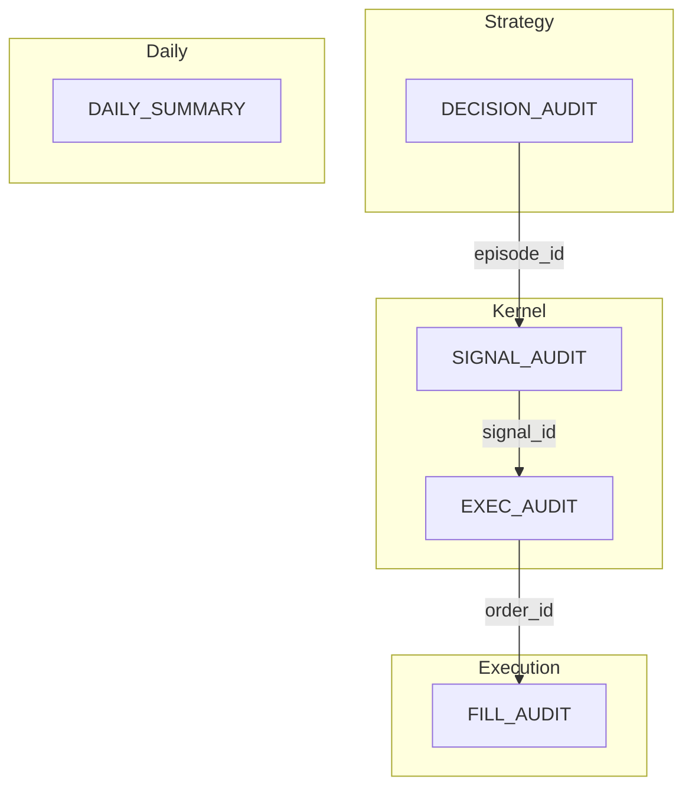

# FT-001 — Audit 事件回放（SPEC）

> **目標**：從單日 log **重建完整決策時間軸**（episode → 訊號 → pending → 成交），無需 regex 拼湊 `MOMENTUM` 行。  
> **現行契約**（過渡期真相）：[`apps/trading-app/SPEC.md`](../../../apps/trading-app/SPEC.md) §Integration contracts。

## 1. Summary

UAT 驗狀態機、Pilot 評 alpha 都需要可解析的 audit。現有 `SIGNAL_AUDIT` / `FILL_AUDIT` / `DAILY_SUMMARY` 能支撐 UAT 與 determinism，但交易視角缺口明顯：

- 動量 **啟動** 無結構化事件（僅 log + 日彙總）
- **出場** audit 缺進場價、grace、stop 門檻
- **風控拒絕** 靜默
- **signal ↔ fill** 無 `signal_id` / `episode_id`

本 ft 定義「合格 audit」的目標契約與 **episode 回放樣貌**；實作見 [`PLAN.md`](PLAN.md)。

## 2. 現況 vs 目標

| 面向 | 現況 | 目標（本 SPEC） |
|------|------|-----------------|
| 動量啟動 | `MOMENTUM 量能通過` log；`DAILY_SUMMARY.momentum_triggers` | `DECISION_AUDIT` `event_type=momentum_armed` + `episode_id` |
| Pullback 未進場 | `NearMissTracker` 日彙總 | `pullback_candidate`（節流）+ 日彙總保留 |
| trend_veto / timeout | 直接寫 `SIGNAL_AUDIT` 但無 OrderSignal | 遷至 `DECISION_AUDIT`（Phase 4 dual-parse） |
| 進場 SIGNAL | 豐富（vol, vwap, trend…） | + `episode_id`, `signal_id`, `elapsed_since_arm_sec`, `dist_vwap` |
| 出場 SIGNAL | 偏薄 | + `entry_price`, `hold_ticks`, `in_grace`, stop levels, `trailing_peak` |
| Kernel pending | regex `委託未成交/已取消` | `EXEC_AUDIT` |
| 成交 | `FILL_AUDIT` | + `signal_id`, `episode_id`（entry） |
| 關聯 | 時間序推斷 | `episode_id` 串漏斗；`signal_id` 串 signal→fill |

## 3. 事件分層



| Prefix | 發射者 | 語意 |
|--------|--------|------|
| `DECISION_AUDIT` | strategy plugin | **不**產生 `OrderSignal` 的決策 |
| `SIGNAL_AUDIT` | kernel `order_executor` | 伴隨 `OrderSignal` 的訊號 |
| `EXEC_AUDIT` | kernel | pending arm / cancel / timeout / position sync |
| `FILL_AUDIT` | app telemetry | 成交結果 |
| `DAILY_SUMMARY` | `DailyObservability` | 日彙總（含 episode 漏斗） |

**序列化**（全 prefix 共用）：`{prefix} {json}`，`json.dumps(..., ensure_ascii=False, separators=(",", ":"))`。

**共通欄位**（MUST，除非該 event_type 明訂省略）：

| 欄位 | 型別 | 說明 |
|------|------|------|
| `audit_schema_version` | int | 本 SPEC = **1** |
| `event_type` | str | 見 §5 |
| `ts` | int | 交易所 epoch 秒 |

## 4. 關聯 ID

| ID | 格式 | 用途 |
|----|------|------|
| `episode_id` | `{trade_date}-{seq}` 例 `20260617-003` | 一次 momentum episode（armed → timeout \| veto \| entry） |
| `signal_id` | `{trade_date}-sig-{seq}` | 每次 `OrderSignal` |
| `order_id` | 券商委託 ID（已有） | 執行層 |
| `parent_id` | 可選 | 指向觸發父事件（例 timeout 的 parent = episode armed） |

**回放鍵**：`(trade_date, episode_id)` 還原漏斗；`(signal_id)` 還原 signal→fill。

## 5. 事件目錄

### 5.1 `DECISION_AUDIT`（strategy）

| event_type | 觸發 | MUST 欄位 | SHOULD |
|------------|------|-----------|--------|
| `momentum_armed` | `_try_activate_momentum` 成功 | `episode_id`, `direction`（Long/Short）, `trigger_price`, `vol_1s`, `buy_ratio`, `sell_ratio`, `vol_threshold`, `multiplier` | `atr`, `vwap` |
| `pullback_candidate` | pullback tick 未同時滿足 band+exhausted | `episode_id`, `price`, `vwap`, `dist_vwap`, `vol_1s`, `near_vwap`, `vol_dried_up` | — |
| `trend_veto` | trend filter 擋下 | 同現行 veto 欄位 + `episode_id` | `atr`, `buy_ratio`, `sell_ratio` |
| `momentum_timeout` | episode 逾 `momentum_timeout_sec` | `episode_id`, `direction`, `elapsed_sec`, `price` | `trend_dir`, `trend_strength` |
| `risk_blocked` | min_atr / consecutive_loss / block_new_entry / after_flatten | `block_reason`, `price` | 依 reason 附 `atr`, `consecutive_loss` |

**壓力上下文（SHOULD，Phase 3–4）** — 適用 `trend_veto`、`momentum_timeout`、`risk_blocked`：

| 欄位 | 說明 |
|------|------|
| `consecutive_veto_streak` | 當日連續 veto 計數（至本事件） |
| `consecutive_timeout_streak` | 當日連續 timeout 計數 |
| `episodes_since_last_entry` | 距上一筆 entry 之間的 episode 數 |

**emit_policy（MAY，Phase 4 文件預留）**：`required` \| `optional` \| `toggleable`。`toggleable` 實作屬 **FT-002**（見 [`REVIEW.md`](REVIEW.md) §6）。

**節流（SHOULD）**：

- `pullback_candidate`：每 `episode_id` 最多 **1 筆**（僅 `dist_vwap` 最小時更新）+ episode 結束時可選 1 筆 `closest_summary`
- `risk_blocked`：同 `block_reason` 每 **60s** 最多 1 筆

### 5.2 `SIGNAL_AUDIT`（kernel，擴充 optional）

既有欄位保留（[`signal_audit.py`](../../../packages/trading-engine/src/trading_engine/core/audit/signal_audit.py)）。新增 **optional**：

| 情境 | 新增欄位 |
|------|----------|
| entry `reason=pullback` | `episode_id`, `signal_id`, `elapsed_since_arm_sec`, `dist_vwap` |
| exit 全類型 | `signal_id`, `entry_price`, `hold_ticks`, `in_grace`, `hard_stop_level`, `vwap_stop_level`, `trailing_peak`；`trail_points_used` 已有 |

### 5.3 `EXEC_AUDIT`（kernel，新建）

| event_type | 觸發 | MUST 欄位 |
|------------|------|-----------|
| `pending_armed` | IOC 送出 | `signal_id`, `order_id`, `limit_price`, `direction` |
| `pending_cancelled` | intent cancelled | `signal_id`, `tag`, `order_id`（若有） |
| `pending_timeout` | pending 逾時 | `signal_id`, `pending_sec` |
| `position_sync` | reconnect reconcile qty 變化 | `qty_before`, `qty_after`, `position_dir` |

### 5.4 `FILL_AUDIT`（擴充 optional）

既有欄位保留。新增 optional：`signal_id`；entry fill 加 `episode_id`。

### 5.5 `DAILY_SUMMARY`（擴充）

保留 `near_miss` 等現行欄位；**SHOULD** 加 `episode_funnel`：

```json
"episode_funnel": {
  "armed": 12,
  "timeout": 4,
  "veto": 0,
  "entered": 3,
  "closest_dist_p50": 1.8
}
```

**壓力指標 `pressure`（SHOULD，Phase 3）** — 詳見 [`REVIEW.md`](REVIEW.md) §3.1：

```json
"pressure": {
  "max_consecutive_veto": 0,
  "max_consecutive_timeout": 5,
  "max_episodes_without_entry": 8,
  "armed_to_entered_ratio": 0.25,
  "risk_blocked_count": 2
}
```

`uat_report` MAY 依 REVIEW 警戒線產生 tuning hints（非 UAT pass 條件）。

## 6. Episode 回放樣貌（核心交付）

以下為 **vwap-momentum** 單日兩條 episode 的目標 log 樣貌（`ts` 遞增）。人類可讀摘要附於後。

### 6.1 成功案例 — episode `20260617-003`（Long，進場並獲利出場）

```text
DECISION_AUDIT {"audit_schema_version":1,"event_type":"momentum_armed","ts":1740126120,"episode_id":"20260617-003","direction":"Long","trigger_price":21845.0,"vol_1s":182,"buy_ratio":0.84,"sell_ratio":0.16,"vol_threshold":150.0,"multiplier":1.0,"vwap":21840.2,"atr":28.5}
DECISION_AUDIT {"audit_schema_version":1,"event_type":"pullback_candidate","ts":1740126185,"episode_id":"20260617-003","price":21843.0,"vwap":21841.0,"dist_vwap":2.0,"vol_1s":22,"near_vwap":true,"vol_dried_up":false}
DECISION_AUDIT {"audit_schema_version":1,"event_type":"pullback_candidate","ts":1740126198,"episode_id":"20260617-003","price":21841.5,"vwap":21841.2,"dist_vwap":0.3,"vol_1s":11,"near_vwap":true,"vol_dried_up":true}
SIGNAL_AUDIT {"audit_schema_version":1,"event_type":"entry_signal","intent":"entry","direction":"Buy","price":21841.5,"ts":1740126198,"episode_id":"20260617-003","signal_id":"20260617-sig-007","elapsed_since_arm_sec":78,"dist_vwap":0.3,"vol_1s":11,"buy_ratio":0.55,"sell_ratio":0.45,"atr":28.5,"vwap":21841.2,"reason":"pullback","trend_dir":"Flat","trend_strength":0.0}
EXEC_AUDIT {"audit_schema_version":1,"event_type":"pending_armed","ts":1740126198,"signal_id":"20260617-sig-007","order_id":"OID-991","limit_price":21844.5,"direction":"Buy"}
FILL_AUDIT {"audit_schema_version":1,"intent":"entry","direction":"Buy","signal_price":21841.5,"fill_price":21843.0,"slippage_pts":1.5,"limit_price":21844.5,"slippage_vs_limit_pts":-1.5,"order_id":"OID-991","ts":1740126199,"signal_id":"20260617-sig-007","episode_id":"20260617-003","ioc_slippage_allowed":3}
SIGNAL_AUDIT {"audit_schema_version":1,"event_type":"exit_signal","intent":"exit","direction":"Sell","price":21858.0,"ts":1740126340,"signal_id":"20260617-sig-008","entry_price":21843.0,"hold_ticks":420,"in_grace":false,"hard_stop_level":21837.0,"vwap_stop_level":21838.2,"trailing_peak":21862.0,"atr":27.8,"vwap":21850.1,"reason":"trailing_stop","trail_points_used":8.0}
EXEC_AUDIT {"audit_schema_version":1,"event_type":"pending_armed","ts":1740126340,"signal_id":"20260617-sig-008","order_id":"OID-992","limit_price":21855.0,"direction":"Sell"}
FILL_AUDIT {"audit_schema_version":1,"intent":"exit","direction":"Sell","signal_price":21858.0,"fill_price":21857.5,"slippage_pts":0.5,"limit_price":21855.0,"slippage_vs_limit_pts":-2.5,"order_id":"OID-992","ts":1740126341,"signal_id":"20260617-sig-008","hold_sec":142,"pnl_points":14.5,"exit_reason":"trailing_stop","ioc_slippage_allowed":3}
```

**人類可讀摘要**

1. 09:02:00 多方動量啟動（ep.003，觸發 21845）
2. 09:03:05–09:03:18 兩次 pullback 候選；第二次量枯竭且貼 VWMA
3. 09:03:18 進場訊號 → IOC → 滑價 1.5 點成交
4. 09:05:40 trailing 出場，持倉 142s，淨 +14.5 點

### 6.2 失敗案例 — episode `20260617-004`（Short，timeout 無進場）

```text
DECISION_AUDIT {"audit_schema_version":1,"event_type":"momentum_armed","ts":1740127200,"episode_id":"20260617-004","direction":"Short","trigger_price":21830.0,"vol_1s":165,"buy_ratio":0.18,"sell_ratio":0.82,"vol_threshold":150.0,"multiplier":1.0,"vwap":21835.5,"atr":26.0}
DECISION_AUDIT {"audit_schema_version":1,"event_type":"pullback_candidate","ts":1740127260,"episode_id":"20260617-004","price":21833.0,"vwap":21834.8,"dist_vwap":1.8,"vol_1s":28,"near_vwap":true,"vol_dried_up":false}
DECISION_AUDIT {"audit_schema_version":1,"event_type":"pullback_candidate","ts":1740127320,"episode_id":"20260617-004","price":21836.0,"vwap":21835.0,"dist_vwap":1.0,"vol_1s":19,"near_vwap":true,"vol_dried_up":false}
DECISION_AUDIT {"audit_schema_version":1,"event_type":"momentum_timeout","ts":1740127380,"episode_id":"20260617-004","direction":"Short","elapsed_sec":180,"price":21838.0,"trend_dir":"Flat","trend_strength":0.0,"parent_id":"20260617-004"}
```

**人類可讀摘要**

1. 09:20:00 空方動量啟動
2. 兩次接近 VWMA 但量未枯竭（`vol_dried_up=false`）
3. 09:23:00 180s timeout，episode 結束，**無** SIGNAL / FILL

### 6.3 風控靜默 → 可見（節流範例）

```text
DECISION_AUDIT {"audit_schema_version":1,"event_type":"risk_blocked","ts":1740129000,"block_reason":"min_atr","price":21820.0,"atr":22.4}
```

### 6.4 高壓情境 — 連續 timeout + veto（ep.005–008）

橫盤日上午：三次 timeout、一次 veto，第四次才進場。`consecutive_*_streak` 為 Phase 3 optional。

```text
DECISION_AUDIT {"audit_schema_version":1,"event_type":"momentum_armed","ts":1740129600,"episode_id":"20260617-005","direction":"Long","trigger_price":21825.0,"vol_1s":170,"buy_ratio":0.81,"sell_ratio":0.19,"vol_threshold":150.0,"multiplier":1.0}
DECISION_AUDIT {"audit_schema_version":1,"event_type":"momentum_timeout","ts":1740129780,"episode_id":"20260617-005","direction":"Long","elapsed_sec":180,"price":21828.0,"consecutive_timeout_streak":1,"episodes_since_last_entry":1}
DECISION_AUDIT {"audit_schema_version":1,"event_type":"momentum_armed","ts":1740129800,"episode_id":"20260617-006","direction":"Long","trigger_price":21830.0,"vol_1s":168,"buy_ratio":0.82,"sell_ratio":0.18,"vol_threshold":150.0,"multiplier":1.0}
DECISION_AUDIT {"audit_schema_version":1,"event_type":"momentum_timeout","ts":1740129980,"episode_id":"20260617-006","direction":"Long","elapsed_sec":180,"price":21831.0,"consecutive_timeout_streak":2,"episodes_since_last_entry":2}
DECISION_AUDIT {"audit_schema_version":1,"event_type":"momentum_armed","ts":1740130000,"episode_id":"20260617-007","direction":"Short","trigger_price":21832.0,"vol_1s":160,"buy_ratio":0.20,"sell_ratio":0.80,"vol_threshold":150.0,"multiplier":1.0}
DECISION_AUDIT {"audit_schema_version":1,"event_type":"momentum_timeout","ts":1740130180,"episode_id":"20260617-007","direction":"Short","elapsed_sec":180,"price":21833.0,"consecutive_timeout_streak":3,"episodes_since_last_entry":3}
DECISION_AUDIT {"audit_schema_version":1,"event_type":"momentum_armed","ts":1740130200,"episode_id":"20260617-008","direction":"Long","trigger_price":21834.0,"vol_1s":175,"buy_ratio":0.83,"sell_ratio":0.17,"vol_threshold":150.0,"multiplier":1.0}
DECISION_AUDIT {"audit_schema_version":1,"event_type":"trend_veto","ts":1740130280,"episode_id":"20260617-008","direction":"Buy","price":21835.0,"vol_1s":12,"reason":"trend_veto","trend_dir":"Short","trend_strength":0.6,"consecutive_veto_streak":1,"episodes_since_last_entry":4}
```

**人類可讀摘要**

1. 09:40–09:49 連續 3 次 episode timeout，無進場
2. 09:50 episode-008 有 pullback 候選但被 trend_veto
3. 日終 `pressure.max_consecutive_timeout=3`、`armed_to_entered_ratio` 偏低 → Daily Reviewer 應標註「漏斗空轉」

## 7. Determinism

- **納入 hash**（延續 [`determinism_check.py`](../../../apps/trading-app/src/sweep/determinism_check.py) 政策）：`DECISION_AUDIT`、`SIGNAL_AUDIT`、`EXEC_AUDIT`、`FILL_AUDIT`、`DAILY_SUMMARY` 的**決策欄位** JSON body
- **排除 hash**：`risk_blocked` 節流序號、`DAILY_SUMMARY.operational` wall-clock（`lock_wait_max_ms` 等，見 app SPEC）
- **向後相容**：Phase 1–3 新欄位皆 **optional**；舊 log 仍可被 `uat_report` 解析
- **遷移**：Phase 4 前 `trend_veto` / `momentum_timeout` 仍可能出現在 `SIGNAL_AUDIT`；consumer **dual-parse** 一版

## 8. 消費者

### 8.1 程式模組

| 模組 | 變更 |
|------|------|
| [`uat_report.py`](../../../apps/trading-app/src/reporting/uat_report.py) | 解析新 prefix；`build_episode_timeline()`；`--episodes` CLI；`pressure` hints |
| [`trend_calibration.py`](../../../apps/trading-app/src/reporting/trend_calibration.py) | veto 優先讀 `DECISION_AUDIT` |
| [`determinism_check.py`](../../../apps/trading-app/src/sweep/determinism_check.py) | hash 納入 DECISION/EXEC |
| [`forward_pnl.py`](../../../apps/trading-app/src/reporting/forward_pnl.py) | join `episode_id` / closest candidate |

### 8.2 Agent 消費者（預留介面，Phase 3）

`build_episode_timeline(log) -> list[EpisodeTimeline]` 為 Agent 交接格式：

```python
# 概念結構（實作時定為 dataclass / TypedDict）
EpisodeTimeline = {
    "episode_id": str,
    "trade_date": str,
    "direction": "Long" | "Short",
    "outcome": "entered" | "timeout" | "veto" | "risk_blocked",
    "events": list[dict],       # 時間序 DECISION/SIGNAL/EXEC/FILL
    "pressure_context": dict,   # 該 episode 結束時的 streak 快照（若有）
}
```

| Agent | 輸入 | 用途 |
|-------|------|------|
| **Daily Reviewer** | 全日 `EpisodeTimeline[]` + `DAILY_SUMMARY.pressure` | 漏斗異常、near-miss、週報 Follow-up |
| **Senior Trading Professional** | 單一 `episode_id` timeline + Phase 5 KPI | Pilot 歸因、高壓演練、調參建議（非 live 指令） |
| **工程 Agent** | raw audit JSON + PLAN phase | FT-001 實作、determinism 測試 |

Grok skills：[`/audit-event-replay`](../../../.grok/skills/audit-event-replay/SKILL.md)、[`/senior-trading-professional`](../../../.grok/skills/senior-trading-professional/SKILL.md)。

## 9. Definition of Done

- [x] 單日 log 可產出 ≥95% episode 清單（對照 legacy `MOMENTUM` regex 計數） — 使用合成 fixture + snapshot 驗證
- [x] `python -m reporting <log> --episodes` 輸出人類可讀 timeline
- [x] `DAILY_SUMMARY.pressure` 與 REVIEW 警戒線 hints 可產出（Phase 3）
- [x] `EpisodeTimeline` 可作為 Agent 交接格式（Phase 3）
- [x] Pilot 審查不再依賴 `MOMENTUM Long|Short 突破` regex 作為主要漏斗來源
- [x] CAL-8：`trend_veto` 100% 帶 `episode_id`；forward_pnl 可 join
- [x] `test_determinism.py` + `test_episode_replay.py` 全綠
- [x] 穩定契約已併入 app SPEC；本 ft Status → **Landed**

## 參考

- 資深交易人員審閱：[`REVIEW.md`](REVIEW.md)
- PLAN：[`PLAN.md`](PLAN.md)
- 現行契約：[`apps/trading-app/SPEC.md`](../../../apps/trading-app/SPEC.md) §Integration contracts
- 策略 audit reason：[`packages/strategies/vwap-momentum/SPEC.md`](../../../packages/strategies/vwap-momentum/SPEC.md) §7