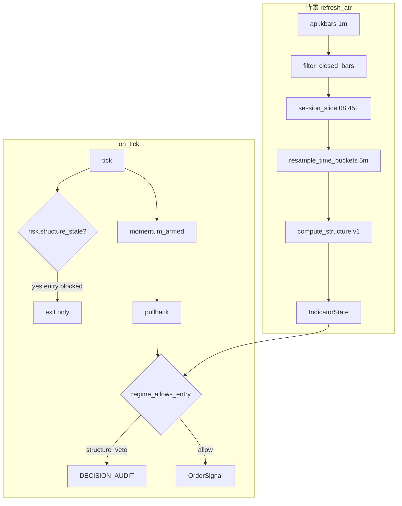

# FT-002 — SMC Structure Filter（SPEC）

> **目標**：用永豐 `api.kbars`（1m OHLCV）在背景算出 SMC 結構狀態，作為 **戰場濾網**（zone + 方向）；**tick 開槍邏輯不變**（momentum armed → pullback entry）。  
> **治理（2026-06-28 更新）**：工程 Phase 1–4 已落地；**CAL-8 / Land 放棄** — 因 **vwap-momentum 已 `grid_no_viable_solution`**，濾網無法把全負 base 變正（**≠** filter 對新 thesis 普適無效；見 §12.1 · Playbook 附錄 A）。`structure_filter_enabled` **維持 false**。  
> 實作順序見 [`PLAN.md`](PLAN.md)。設計審閱見 [`REVIEW.md`](REVIEW.md)。

## 1. Summary

### 問題

現行 P6-1 戰場濾網（[`trend.py`](../../../packages/strategies/vwap-momentum/src/strategy_vwap_momentum/trend.py)）以 1m close stride resample + EMA/slope 估計 HTF bias。可行，但是 **intraday proxy**（非 macro bias），且無法表達 SMC zone 語意。

### 目標

| 層級 | 資料 | 職責 | 本 ft |
|------|------|------|-------|
| **戰場** | kbars 1m → 5m 時間桶 | bias、FVG、BOS、sweep、premium/discount | **是** |
| **開槍** | on_tick | momentum + pullback + exit | **否** |

### 模型誠實性（MUST 寫進 harness 解讀）

- SMC 與 trend 同樣是 **5m resample + ATR norm 的日內結構 proxy**；不得宣稱「讀懂聰明錢」。
- `delta_expectancy` **必須**來自真實 UAT tick + kbar 對照；合成測試僅驗演算法，不構成 Go 依據。
- `structure_min_strength=0.0` = **最嚴格**（最多 veto），與 `trend_min_strength` 語意相同；校準報告 MUST 標註，避免交易員誤解。

### 一句話

**kbars 定戰場，tick 定開槍** — 升級戰場濾網為 frozen SMC v0.1；進出場 tick 邏輯零改動。

---

## 2. 現況 vs 目標

| 面向 | 現況 | 目標 |
|------|------|------|
| 戰場濾網 | `compute_trend` + `trend_allows_entry` | `compute_structure` + `structure_allows_entry` |
| 統一閘道 | 直接 `trend_allows_entry` | `regime_allows_entry`（互斥選一） |
| 背景刷新 | `TrendRefreshPort` | + `StructureRefreshPort`（同 `refresh_atr()`） |
| Stale 護欄 | `RiskGate.atr_stale` | + `RiskGate.structure_stale`（filter on 時） |
| Sweep | `SWEEP_FIELD_TO_CONST` 含 `trend_*` | + `structure_*` + 互斥驗證 |
| Gate | §P6-1-CAL | §P6-SMC-CAL（CAL-8）；Pilot 仍走 [`uat/APP.md`](../../uat/APP.md) Phase 5 |

**明確不變**：`_try_activate_momentum`、pullback 條件、`manage_exit`、qty=1、pending 狀態機。

---

## 3. 架構與資料流



**紀律**（[`AGENTS.md`](../../AGENTS.md) §6.4）：

- `compute_structure` **僅**在 `refresh_atr()` 背景執行
- **禁止** callback 內 `api.kbars`
- live / backtest **同一** no-lookahead 規則（§4.2）

---

## 4. Frozen 演算法 v0.1（`structure_algo_version: 1`）

> 變更任一條款 → bump `structure_algo_version` + 重跑 harness + 人類重簽 CAL-8。

### 4.1 輸入 / 輸出

**輸入**：

| 參數 | 說明 |
|------|------|
| `bars_1m` | `KBarRecord[]`；**進入前**已過 §4.2 過濾 |
| `atr` | engine 既有 ATR（>0 才做 Level-2） |
| `params` | §5.1 |
| `exchange_dt` | 交易所本地時間；session 切片錨點 |
| `as_of_ts` | 決策時刻 epoch 秒（harness / backtest 用；live = 上次 refresh 錨點） |

**輸出**：`StructureState`

```python
@dataclass(frozen=True)
class StructureState:
    algo_version: int          # = 1
    bias: str                  # Long | Short | Neutral
    strength: float            # |close - range_mid|；signed 僅 audit
    in_discount: bool
    in_premium: bool
    active_fvg_low: float | None
    active_fvg_high: float | None
    active_fvg_side: str | None   # "bullish" | "bearish" | None
    last_bos: str | None          # bullish | bearish | None
    last_bos_ts: datetime | None
    sweep_reclaim: bool
    sweep_side: str | None        # bullish | bearish | None
    range_high: float
    range_low: float
    range_mid: float
    as_of_bar_ts: datetime | None # 最後一根納入計算的已收盤 5m bar
```

### 4.2 No-lookahead 與 bar 過濾（MUST）

在 `resample` 與 `compute_structure` **之前**套用（live `refresh_atr` 與 backtest `MockBroker.kbars` **同一規則**）：

1. **1m 已收盤**：`bar.ts + timedelta(minutes=1) <= exchange_dt`（或 backtest `current_dt`）
2. **5m 已收盤**：resample 產出的 5m bar 同樣須 `bar5.ts + 5min <= exchange_dt`
3. **不完整桶**：當前時間未收完的 5m 桶 **不產出**（不可拿 partial bucket 算 BOS/FVG）

`refresh_atr` 拉取的 kbars 可含多日；`compute_structure` 內 MUST 再切片，不可假設 API 回傳即為當日 session。

### 4.3 Session 切片與 range（MUST）

對齊 [`TradingAppTrendRefresh`](../../../apps/trading-app/src/integrations/trend_refresh.py) + [`select_recent_trading_days_closes`](../../../packages/trading-engine/src/trading_engine/calendar/taifex.py) 精神：

| 規則 | 定義 |
|------|------|
| **交易日錨點** | `exchange_dt.date()`；若 `exchange_dt.time() < 08:45` → 視為前一交易日 session 延續（不開新 range） |
| **range 起算** | 當交易日 **第一根 ≥08:45 的已收盤 1m bar** 起，至 `exchange_dt` 為止 |
| **range_high / range_low** | 上述區間內所有已收盤 1m bar 的 High/Low 極值（**不含**夜盤、不含前日） |
| **range_mid** | `(range_high + range_low) / 2` |
| **夜盤 / 前日 bar** | 不得納入 range、不得觸發 BOS/FVG；僅允許用於 ATR 暖身（與 trend 長 lookback 分離） |
| **`used_long_lookback`** | `StructureRefreshPort` 收到此旗標時：**忽略**長 lookback 內非當日 session 的 bar 做 BOS/FVG/sweep；range 仍只算當日 session。長 lookback 僅供 ATR，不污染 structure |

**測試 MUST 涵蓋**：gap day、session start 首根 bar、前日夜盤 bar 在輸入中但不出現在 range/BOS。

### 4.4 Resample（5m 時間桶）

- TF = `structure_timeframe_min`（預設 **5**）
- 桶邊界：牆鐘對齊 `(minute // 5) * 5`，秒=0
- 桶內聚合：`Open`=第一根 open，`High`=max，`Low`=min，`Close`=最後一根 close，`Volume`=sum
- **禁止** `resample_closes` stride

### 4.5 Swing pivot 確認（lag 寫死）

參數：`L = structure_swing_lookback`（預設 **2**）。

對已收盤 5m 序列索引 `i`：

- **候選 swing high**：`bar[i].High` 嚴格大於 `bar[i±k].High`（k=1..L 兩側皆比較）
- **候選 swing low**：`bar[i].Low` 嚴格小於 `bar[i±k].Low`
- **確認 lag**：候選在索引 `i` 成立後，須再等 **L 根**已收盤 5m bar 仍不被打破，才在索引 `i+L` 標記為 **confirmed**
- **`last_confirmed_swing_high/low`**：截至 `as_of` 最近一組 confirmed pivot 價格

> 意義：避免「當根就當 pivot」的 repaint；代價是結構訊號延遲 L 根 5m。

### 4.6 BOS（Break of Structure）

在 **confirmed swing** 基礎上，對每根已收盤 5m bar `j`：

| 事件 | 條件 |
|------|------|
| **bullish BOS** | `bar[j].Close > last_confirmed_swing_high` 且該 swing high 的確認時間 **早於** `bar[j].ts` |
| **bearish BOS** | `bar[j].Close < last_confirmed_swing_low` 且確認時間 **早於** `bar[j].ts` |

- **`last_bos`**：截至 `as_of` 時間序最後一個 BOS 方向（bullish→bias Long 候選；bearish→Short）
- **`last_bos_ts`**：該 BOS bar 的 `ts`
- 若 `as_of` 當日 session 無任何 BOS → `last_bos = None`

### 4.7 FVG 偵測與 lifecycle（寫死）

對連續三根已收盤 5m `b0, b1, b2`（`b1` 為 displacement 中間根）：

| 類型 | 成立條件 | Zone |
|------|----------|------|
| **bullish FVG** | `b0.High < b2.Low` | `[fvg_low, fvg_high] = [b0.High, b2.Low]` |
| **bearish FVG** | `b0.Low > b2.High` | `[fvg_high, fvg_low] = [b0.Low, b2.High]`（`fvg_low < fvg_high` 仍成立） |

**Mitigation（完全填補）** — bar `x` 在 FVG 建立後：

```
mitigated := (x.Low <= fvg_low) AND (x.High >= fvg_high)
```

- **partial touch**（僅刺入 zone 但未同時覆蓋上下界）→ **未** mitigated
- mitigated 後該 FVG 自 active 集合移除

**Active FVG 選擇**（多個未 mitigated 時）：

1. 僅保留與 `bias` 同向的 FVG（bullish FVG 配 Long bias；bearish 配 Short）
2. 若多個：取 **建立時間最新** 且 **尚未 mitigated** 者
3. 若 `bias == Neutral`：不選 active FVG（`active_fvg_* = None`）

輸出 `active_fvg_low/high/side` 為上述唯一選中缺口。

### 4.8 Sweep reclaim

在 **confirmed swing** 上，對當根已收盤 5m bar `j`：

| 事件 | 條件 |
|------|------|
| **bullish sweep** | `bar[j].Low < last_confirmed_swing_low` **且** `bar[j].Close > last_confirmed_swing_low` |
| **bearish sweep** | `bar[j].High > last_confirmed_swing_high` **且** `bar[j].Close < last_confirmed_swing_high` |

- **`sweep_reclaim`**：截至 `as_of` **當日 session** 是否發生過 sweep（任一方向）
- **`sweep_side`**：最近一次 sweep 方向；無則 `None`
- sweep **不單獨**改 bias；僅供 audit / harness

### 4.9 Premium / Discount

對最後一根納入的已收盤 5m bar 的 `Close`（記為 `px`）：

- `px < range_mid` → `in_discount = True`
- `px > range_mid` → `in_premium = True`
- `px == range_mid` → 兩者皆 `False`

### 4.10 Bias 與 Level-2 gate

1. 若 `last_bos == bullish` → 候選 `bias = Long`；`bearish` → `Short`；否則 `Neutral`
2. Level-2：若候選非 Neutral 且 `atr > 1e-6`：
   - `eff = |px - range_mid| / atr`
   - 若 `eff < structure_min_strength` → 強制 `bias = Neutral`，`strength = 0`
   - 否則 `strength = eff`（audit 用正值）
3. `structure_min_strength=0.0`：任一非零 eff 才保留 bias；零位移一律 Neutral

### 4.11 `structure_allows_entry`

| 條件 | 結果 |
|------|------|
| `not enabled` | allow |
| `bias == Neutral` | allow（permissive，同 trend） |
| `bias != momentum_dir` | **veto** |
| Long | `in_discount` **或** `active_fvg_low <= price <= active_fvg_high` |
| Short | `in_premium` **或** 同上 FVG 區間 |

**FVG 價格判定**：`price` 為 tick `close`（float）；邊界 inclusive。

### 4.12 `regime_allows_entry`

```python
def regime_allows_entry(...) -> tuple[bool, str]:
    # returns (allowed, veto_reason)
    # veto_reason in ("", "trend_veto", "structure_veto")
```

| structure | trend | 行為 |
|-----------|-------|------|
| false | false | allow |
| true | false | `structure_allows_entry` |
| false | true | `trend_allows_entry` |
| true | true | **禁止**（§5.2） |

---

## 5. Config 契約

### 5.1 欄位

```yaml
structure_filter_enabled: false
structure_timeframe_min: 5
structure_swing_lookback: 2
structure_min_strength: 0.0   # ATR 單位；0.0 = 最嚴格（最多 veto）
```

### 5.2 互斥（MUST，三處同步）

| 位置 | 行為 |
|------|------|
| [`config.py`](../../../apps/trading-app/src/config.py) `load_config` | 兩者皆 true → **`ValueError`** |
| [`runtime_config.py`](../../../packages/trading-engine/src/trading_engine/core/runtime_config.py) `apply_strategy_params` | 兩者皆 true → **拒絕** |
| [`param_sweep.py`](../../../apps/trading-app/src/sweep/param_sweep.py) grid 展開 | 若組合同時 true → **跳過並記錄 warning** |

### 5.3 Sweep 映射（MUST）

加入 `SWEEP_FIELD_TO_CONST` 與 `_CONST_TO_SNAKE`：

- `structure_filter_enabled` ↔ `STRUCTURE_FILTER_ENABLED`
- `structure_timeframe_min` ↔ `STRUCTURE_TIMEFRAME_MIN`
- `structure_swing_lookback` ↔ `STRUCTURE_SWING_LOOKBACK`
- `structure_min_strength` ↔ `STRUCTURE_MIN_STRENGTH`

[`settings.py`](../../../packages/trading-engine/src/trading_engine/settings.py) + app `Settings` dataclass 同步新增欄位。

### 5.4 Iron rules

- 預設 `structure_filter_enabled: false`
- 無 B-class harness + CAL-8 → 不得開啟
- CAL-8 Go **≠** Pilot Ready（§8.2）

---

## 6. Engine 契約

### 6.1 `StructureRefreshPort`

```python
class StructureRefreshPort(Protocol):
    def refresh_structure(
        self, kbars: Any, *, exchange_dt: datetime | None,
        used_long_lookback: bool, atr: float, cfg: RuntimeConfig,
    ) -> StructureState: ...
```

[`structure_refresh.py`](../../../apps/trading-app/src/integrations/structure_refresh.py)：

1. 將 raw kbars 轉 `KBarRecord[]`
2. 套用 §4.2 closed-bar 過濾（`exchange_dt` 錨點）
3. 呼叫 `compute_structure(..., used_long_lookback=...)`
4. **`used_long_lookback`**：啟用時剝離非當日 session bar 後再算 structure（§4.3）；不得把前日 close 算入 range

### 6.2 `MarketSnapshot` 擴充

| 欄位 | filter off 預設 |
|------|-----------------|
| `structure_bias` | `"Neutral"` |
| `structure_strength` | `0.0` |
| `structure_in_discount` / `structure_in_premium` | `false` |
| `structure_fvg_low/high` | `None` |
| `structure_sweep_reclaim` | `false` |

策略在 `structure_filter_enabled=false` 時 **不得**讀取上述欄位做決策。

### 6.3 `RiskGate.structure_stale`（MUST）

| 項目 | 定義 |
|------|------|
| 欄位 | `RiskGate.structure_stale: bool`（[`types.py`](../../../packages/trading-engine/src/trading_engine/core/types.py)） |
| 判定 | `_is_structure_stale(ts)`：僅當 `structure_filter_enabled`；成功 refresh 的 `last_structure_refresh` 與 `atr_stale` **同公式**（`atr_refresh_sec × atr_stale_multiplier`） |
| filter off | 恆 `False` |
| refresh 失敗 | 不更新 `last_structure_refresh` → 趨向 stale |
| 策略行為 | 同 `atr_stale`：擋 **entry**、允許 **exit** / force-flatten（[`strategy.py`](../../../packages/strategies/vwap-momentum/src/strategy_vwap_momentum/strategy.py) `evaluate` 開頭） |
| audit | stale 擋 entry 時應有 `risk_blocked` / `block_reason=structure_stale`（與 atr 對稱） |

### 6.4 `refresh_atr` 掛載

[`engine.py`](../../../packages/trading-engine/src/trading_engine/engine.py)：

- `structure_filter_enabled` 時：成功 ATR 後呼叫 `refresh_structure`；更新 `IndicatorState` + `last_structure_refresh`
- 與 trend refresh **獨立**：可僅開 structure（trend 不算）

---

## 7. Audit（FT-001）

| event_type | MUST 欄位 |
|------------|-----------|
| `structure_veto` | `episode_id`, `structure_bias`, `momentum_dir`, `price`, `vwap`, `structure_algo_version` |
| `structure_veto` SHOULD | `structure_in_discount`, `structure_in_premium`, `structure_fvg_low/high`, `structure_strength`, `active_fvg_side` |
| `momentum_armed` SHOULD | 同上 structure 欄位（armed 當下戰場快照） |
| `risk_blocked` | `block_reason=structure_stale`（若適用） |

---

## 8. P6-SMC-CAL 與 Gate 對齊

### 8.1 P6-SMC-CAL（本 ft Live gate）

| 步驟 | 要求 |
|------|------|
| 累積 | ≥5 交易日 UAT；`TICK_ARCHIVE=1` + `KBARS_ARCHIVE=1` |
| Harness | 三組 **分開跑**：無濾網 / structure only / trend only |
| Harness 輸出 | veto vs 放行單的 **friction-adjusted** expectancy 貢獻 |
| armed join | 以 armed `ts` 重算 `compute_structure`（kbar 快照 as-of），量測 30s conversion |
| Sweep | `structure_min_strength` grid：0.0, 0.3, 0.5, 0.8, 1.0, 1.5 |
| CAL-8 | 人類簽核 → [`WeeklyStatus.md`](../../WeeklyStatus.md) |

**Go（CAL-8）**：`delta_expectancy` 穩定為正 + `veto_rate` 合理 + ≥3 structure_veto near-miss 人工審閱。

**No-Go**：維持 `structure_filter_enabled=false`。

### 8.2 與 Pilot Phase 5 的關係（MUST 區分）

| Gate | 門檻 | 文件 |
|------|------|------|
| **CAL-8（本 ft）** | harness + 5 日 UAT 結構證據 | 本 SPEC §8.1 |
| **Pilot Ready** | 20 日 + 80 round-trip + 最近 10 日 35 筆 + Expectancy net/gross + Sharpe + MDD + 零 Critical 10 日 + near-miss + 人類簽核 | [`uat/APP.md`](../../uat/APP.md) Phase 5 |

**UAT Ready ≠ Pilot Ready**。開 `structure_filter_enabled` 僅是 CAL-8 層決策；上 Pilot 仍須完整 Phase 5。

---

## 9. 消費者與 Land 文件（MUST）

ft **Landed** 前 MUST 併入：

| 文件 | 章節 |
|------|------|
| [`apps/trading-app/SPEC.md`](../../../apps/trading-app/SPEC.md) | §Integration contracts |
| [`packages/trading-engine/SPEC.md`](../../../packages/trading-engine/SPEC.md) | RiskGate、refresh_atr、MarketSnapshot |
| [`packages/strategies/vwap-momentum/SPEC.md`](../../../packages/strategies/vwap-momentum/SPEC.md) | §SMC（連結本 ft） |
| [`docs/AGENTS.md`](../../AGENTS.md) | §3 旗標治理 + 互斥 |
| [`docs/TODO.md`](../../TODO.md) | §P6-SMC-CAL |
| [`CHANGELOG.md`](../../../CHANGELOG.md) | 跨 package 條目 |

---

## 10. Determinism / 相容性

- `compute_structure` 純函數；同一輸入 → 同一 `StructureState`
- **Phase 1 驗收**：`structure_filter_enabled=false` 時，策略行為與現行 **bit-for-bit 等價**（audit hash 不含新欄位差異）
- **Phase 4 驗收**：filter on 時 3-run determinism hash 通過
- backtest fidelity 限制仍適用（MockBroker 滑價、無 order book）— harness 解讀時 MUST 註明

---

## 11. Definition of Done

- [ ] §4.3–4.10 測試全覆蓋（含 gap、session start、partial FVG touch、incomplete bar、swing lag）
- [ ] `structure_stale` 完整接線（RiskGate + engine + strategy + audit）
- [ ] 互斥三處 + sweep 映射
- [ ] harness 三組 counterfactual + friction 報表
- [ ] CAL-8 紀錄（Go 或 No-Go）
- [ ] §9 全部文件併入
- [ ] ft **Landed** — **取消**（MVPClosed）

---

## 12. §Decision — MVPClosed CAL-8 path（2026-06-28）

| 欄位 | 值 |
|------|-----|
| 工程 Phase 1–4 | **完成** — `structure.py`、engine 接線、audit、determinism |
| CAL-8 / Phase 5 Land | **放棄** — 濾網僅服務 vwap-momentum；FT-003 **`grid_no_viable_solution`** |
| 執行 | `structure_filter_enabled` / `trend_filter_enabled` **維持 false** |
| 新 thesis | 若未來新 plugin 需要 regime 濾網，**另開 ft** 重評；不沿用本輪 CAL-8 |
| 參考 | [`strategy_diagnosis.md`](../../../workspaces/strategy_diagnosis.md) §8.2.1 |

### 12.1 常見誤解（Agent / session 對齊）

**本輪 CAL-8 放棄的因果**：vwap-momentum hybrid **進場已無可交易 edge**（淨期望全負、§6.1 逆向選擇）→ trend/structure 濾網在 harness 上 **無法創造 alpha** → 停止 CAL-8 / Land。

**不得推論為**：

- 「EMA / SMC / regime filter 對 **所有** 策略無用」
- 「Playbook 禁止新 FT 含 filter」（禁止的是 **事後 rescue** 已結案 grid，見 Playbook 附錄 A）
- 「FT-016 GDC / FT-019 SFBT 等 liquidity 族不可探索時段或 regime 子群」（Entry Lab 允許；須 pre-register 才進 gate）

**一句話**：濾網沒救活 **已死的 host**；不代表濾網對 **新進場機制** 沒火花。

---

## 參考

- PLAN：[`PLAN.md`](PLAN.md)
- REVIEW：[`REVIEW.md`](REVIEW.md)
- Trend 對照：[`strategy-vwap-momentum/SPEC.md`](../../../packages/strategies/vwap-momentum/SPEC.md) §6
- Pilot gate：[`uat/APP.md`](../../uat/APP.md) Phase 5
- txf-gates：[`prompts/roles/references/txf-gates.md`](../../../prompts/roles/references/txf-gates.md)