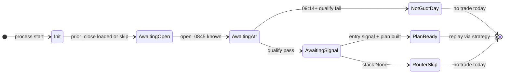

# FT-022 — 統一策略載入（SPEC）

> **SPEC** = `python -m backtest` / `python -m live` 以 workspace `config.yaml` 的 `strategy.name` 載入任意已註冊 plugin；GUDT replay 走共用 bootstrap。  
> **策略邏輯**見 **FT-021**（[`gudt-route-a/SPEC.md`](../gudt-route-a/SPEC.md)）；本 ft 只定 **host 接線契約**。

## 1. Summary

**問題**：`load_named_strategy()` 已實作，但 `python -m backtest` / `python -m live` 仍硬編碼 `default_strategy()` → `vwap_momentum`。各 baseline 需獨立 FT script（`ft021_run_baseline.py` 等）重複 probe + wiring。

**目標**：改 `CONFIG_PATH`（或 `--config`）後重啟 process，同一套 CLI 切換策略；GUDT backtest 離線 bootstrap；GUDT live **staged** bootstrap（非盤前一次算完）。

**使用者**：所有 `workspaces/*-baseline`；UAT / 回測；live 僅在 FT-021 parity 全綠 + 人類 Go 後 pilot。

## 2. 現況 vs 目標

| 面向 | 現況 | 目標（本 SPEC） |
|------|------|-----------------|
| Backtest CLI | `BacktestEngine` → `default_strategy()` | `build_strategy_session()` ← `strategy.name` |
| Live CLI | `default_strategy()` | 同上 + GUDT staged bootstrap |
| Config | `strategy:` 區塊有參數，**無 `name` 解析**（gudt workspace 已手寫） | `strategy.name` → entry point |
| GUDT plans | 僅 `ft021_run_baseline.py` | `strategy_bootstrap.bootstrap_gudt_route_a()` |
| 切換策略 | 改 script / 改 code | 改 `config.yaml` + 重啟 |
| Reporting | `emit_report` → vwap 語意 `baseline.json` | Phase 5：可選 `research.json` / `parity.json`（見 §8） |

## 3. 依賴與邊界

| ft | 關係 |
|----|------|
| **FT-021** | GUDT plugin、`day_plans` replay、parity oracle（**+1781** stack） |
| 根 [`SPEC.md`](../../../SPEC.md) §4 | 策略 entry point 清單 |
| [`apps/trading-app/SPEC.md`](../../../apps/trading-app/SPEC.md) | 落地後併入 §Integration contracts |

**本 ft 不做**：策略交易邏輯、盤中熱切換、`strategy.params` dict schema（見 Follow-up FT）、`StrategyDescriptor` / engine indicator 條件更新。

## 4. Config 契約（Phase 1）

### 4.1 `strategy.name`

```yaml
strategy:
  name: gudt_route_a   # 省略時預設 vwap_momentum
  # …策略專用參數（flat，Phase 1）…
```

| 欄位 | 型別 | 預設 | 說明 |
|------|------|------|------|
| `strategy.name` | str | `vwap_momentum` | MUST 對應 `trading_engine.strategies` entry point |

**已知 name（Phase 1 MUST 支援）**：`vwap_momentum`、`momentum_continuation`、`vwap_stretch_fade`、`opening_range_breakout`、`gudt_route_a`。

未知 name → 啟動時 `LookupError`（fail fast，不 silent fallback）。

### 4.2 GUDT 專用鍵（flat，對齊 `GudtRouteAParams`）

| YAML 鍵 | 對應常數 | 預設 |
|---------|----------|------|
| `gudt_pre_break_br_min` | `GUDT_PRE_BREAK_BR_MIN` | `0.35` |
| `gudt_flip_min_ext_open` | `GUDT_FLIP_MIN_EXT_OPEN` | `5.0` |
| `gudt_extension_exit` | `GUDT_EXTENSION_EXIT` | `ema5` |
| `gudt_confirm_min_dump_atr` | `GUDT_CONFIRM_MIN_DUMP_ATR` | `0.65` |
| `gudt_confirm_slope2_min` | `GUDT_CONFIRM_SLOPE2_MIN` | `-0.35` |
| `gudt_confirm_slope2_max` | `GUDT_CONFIRM_SLOPE2_MAX` | `0.0` |
| `gudt_friction_points` | `GUDT_FRICTION_POINTS` | `5.0` |
| `gudt_p0_ext_open_max` | `GUDT_P0_EXT_OPEN_MAX` | （省略 = 無 chase veto） |

### 4.3 GUDT bootstrap 輸入（可選）

| YAML 鍵 | 預設 | 說明 |
|---------|------|------|
| `gudt_probe_csv` | `workspaces/gudt-baseline/reports/gudt_wash_probe_merged_202505_202606.csv` | probe 列來源 |
| `gudt_probe_from_ticks` | `false` | `true` 時忽略 CSV，改 `run_probe_range` |

`Settings` / `TradingAppRuntimeConfig` MUST 暴露 `strategy_name` 與上述欄位供 `GudtRouteAParams.from_runtime_config()` 讀取。

### 4.4 Workspace 標準化

| Workspace | `strategy.name` |
|-----------|-----------------|
| `apps/trading-app/config/config.yaml` | `vwap_momentum`（註解明示） |
| `workspaces/gudt-route-a-baseline/` | `gudt_route_a`（已有） |
| `workspaces/mc-baseline/` | `momentum_continuation` |
| `workspaces/vsf-baseline/` | `vwap_stretch_fade` |
| `workspaces/orb-baseline/` | `opening_range_breakout` |

## 5. App 層 API 契約

### 5.1 `build_strategy_session`

模組：[`apps/trading-app/src/integrations/engine_wiring.py`](../../../apps/trading-app/src/integrations/engine_wiring.py)

```python
def build_strategy_session(
    cfg: RuntimeConfig,
    obs: DailyObservability,
    *,
    code: str,
    dates: list[date],
    cache_dir: Path,
    mode: Literal["backtest", "live"] = "backtest",
    **extra_kwargs: Any,
) -> Strategy:
    ...
```

行為：

1. `name = cfg.strategy_name`（或等價屬性）
2. `kwargs = resolve_strategy_bootstrap(name, cfg, code=code, dates=dates, cache_dir=cache_dir, mode=mode, obs=obs)`
3. `kwargs.update(extra_kwargs)`
4. `return load_named_strategy(name, cfg, obs, **kwargs)`

### 5.2 `resolve_strategy_bootstrap`

模組：[`apps/trading-app/src/integrations/strategy_bootstrap.py`](../../../apps/trading-app/src/integrations/strategy_bootstrap.py)（新檔）

| `strategy.name` | 回傳 |
|-----------------|------|
| 非 `gudt_route_a` | `{}` |
| `gudt_route_a` | `{"day_plans": dict[str, DayReplayPlan]}` |

### 5.3 `bootstrap_gudt_route_a`

```python
def bootstrap_gudt_route_a(
    cfg: RuntimeConfig,
    *,
    code: str,
    dates: list[date],
    cache_dir: Path,
    mode: Literal["backtest", "live"],
    obs: DailyObservability | None = None,
) -> dict[str, Any]:
    ...
```

| `mode` | 行為 |
|--------|------|
| `backtest` | 對 `dates` 全範圍：CSV 或 `run_probe_range` → `build_replay_plans_for_range`（與 `ft021_run_baseline.py` 等價） |
| `live` | 見 §6；只保留 **當日** plan；staged 增量 |

抽取來源：[`ft021_run_baseline.py`](../../../apps/trading-app/src/scripts/ft021_run_baseline.py) L92–108。

## 6. GUDT live staged bootstrap

### 6.1 資料需求（名詞）

| 資料 | 用途 | Live 來源 |
|------|------|-----------|
| `prior_close` | gap 篩選 | 前一**交易日** kbar 最後 `Close`（週一→週五） |
| 當日 1m kbars | `open_0845`、ATR@09:14 | `KBARS_ARCHIVE` / API |
| 當日 tick | flow_turn / p0 進場 | tick feed / `TICK_ARCHIVE` |

僅昨收 kbar **不足**；不可假設 08:30 盤前一次算完 plan。

### 6.2 狀態機



| 狀態 | 進入條件 | 動作 |
|------|----------|------|
| `Init` | live 啟動 | 載入 `prior_close` lookback；缺則 log `no_prior_close` + 當日 skip |
| `AwaitingOpen` | 08:45 前 | 累積 tick；缺 08:45 bar → `no_open_0845` |
| `AwaitingAtr` | 08:45+，09:14 前 | log `awaiting_atr`（**節流 5 分鐘**） |
| `NotGudtDay` | 09:14+ gap/ATR/retrace 不過 | log `not_gudt_day` + `gap_pts`/`atr`；**當日不再 probe** |
| `AwaitingSignal` | qualify pass | 等進場訊號 tick |
| `PlanReady` | probe + `build_replay_plan` 成功 | `strategy.apply_intraday_plan(today, plan)` |
| `RouterSkip` | stack 回傳 None | log `router_skip` + `path` |

### 6.3 `skip_reason` enum（MUST，不可自創）

| `skip_reason` | 層級 | 情境 |
|---------------|------|------|
| `no_prior_close` | WARNING | 缺前一交易日 kbar |
| `no_open_0845` | WARNING | 缺當日 08:45 bar |
| `awaiting_atr` | INFO | 09:14 前（節流 5min） |
| `not_gudt_day` | INFO | gap/ATR/retrace 不過 |
| `router_skip` | INFO | stack veto 後無 ft |
| `probe_error` | ERROR | 例外 / 資料損壞 |

**Log 最少欄位**：`day`、`strategy=gudt_route_a`、`skip_reason`、`action=skip`；可得則加 `gap_pts`、`atr`、`ext_open`、`prior_close`。

**搜尋鍵**：log 含 `gudt_skip` 或結構化 `skip_reason`。

Backtest：同樣 log（INFO）；CLI 可選 `--quiet-gudt-skip` 壓縮非交易日（預設仍記 summary 計數）。

### 6.4 Live 掛點（Phase 4 實作契約）

- **Driver**：`GudtLiveBootstrapCoordinator`（app 層，**不在** `TradingEngine` 核心）
- **觸發**：每 tick 回調後由 coordinator 更新當日 tick buffer；kbar 來自 archive 檔或即時聚合（MUST NOT 在 engine lock 內跑 probe）
- **注入**：`GudtRouteAStrategy.apply_intraday_plan(day, plan)` — 當日 mid-day 更新時重載 `_pending_events`（Phase 4 新增；不破壞 backtest 離線注入）

## 7. CLI 契約

### 7.1 Backtest

```bash
CONFIG_PATH=workspaces/gudt-route-a-baseline/config/config.yaml \
  python -m backtest --config workspaces/gudt-route-a-baseline/config/config.yaml \
  --dates-from-cache --from-date 2025-05-01 --to-date 2026-06-30 --report
```

| 旗標 / env | 行為 |
|------------|------|
| `--config PATH` | 等同 `CONFIG_PATH`；預設 `apps/trading-app/config/config.yaml` |
| 已注入 `strategy` + `runtime_config` | `BacktestEngine` **不得** fallback `default_strategy()` |

流程：`load_config` → `build_strategy_session(..., mode="backtest")` → `BacktestEngine.run()` → `emit_report`（Phase 5 演進見 §8）。

### 7.2 Live

```bash
CONFIG_PATH=workspaces/gudt-route-a-baseline/config/config.yaml python -m live
```

- MUST 讀 `CONFIG_PATH` / config 的 `strategy.name`
- GUDT：`mode="live"` bootstrap + `GudtLiveBootstrapCoordinator`
- `simulation: true` gate 維持；parity 全綠前不得 pilot

### 7.3 FT baseline 遷移

`ft004/006/009/021_run_baseline.py` → 薄 wrapper：`CONFIG_PATH` + 呼叫 `backtest.main()` 或共用 helper。長期 deprecated，推薦統一 CLI。

## 8. Reporting（Phase 5）

**原則**：engine 只寫 audit log；CF 指標在 app research 層。

| 檔案 | 內容 | 策略 |
|------|------|------|
| `reports/baseline.json` | 現 kernel 指標 | 過渡期保留；**別名** `kernel.json` 可並寫 |
| `reports/research.json` | CF ledger、skip 統計 | 僅 `gudt_route_a` |
| `reports/parity.json` | kernel vs CF | 合併 `ft021_parity_check` 邏輯 |
| `reports/summary.md` | 人類可讀合併 | 可選 |

Parity oracle SSOT：[`ROUTE_A_UAT_STACK.md`](../../../workspaces/gudt-baseline/ROUTE_A_UAT_STACK.md) + [`ft021_parity_check.py`](../../../apps/trading-app/src/scripts/ft021_parity_check.py)（**+1781** / extend=4 / flip=2）。

## 9. Out of scope

- 盤中熱切換策略
- GUDT tick-native 盤中信號（取代 day_plans）
- Kernel PnL 與 CF 完全一致（fill model 另開 FT）
- `gudt_p0_ext_open_max=4.5` 進 default spec
- Phase 6 模組化（`StrategyDescriptor`、`strategy.params` dict、`needs_indicators`）→ Follow-up

## 10. Definition of Done

### Phase 1 — Config + factory

- [x] `config.py` 解析 `strategy.name` + GUDT flat 鍵
- [x] `build_strategy_session` / `resolve_strategy_bootstrap`（非 gudt → `{}`）
- [x] 五 workspace + app 預設 config 補 `strategy.name`
- [x] `test_engine_wiring.py`：五 name smoke

### Phase 2 — GUDT backtest bootstrap

- [x] `strategy_bootstrap.py` + backtest 全日離線 plan
- [x] `test_strategy_bootstrap.py`：plans 非空、skip day、skip log + reason

### Phase 3 — Unified backtest CLI

- [x] `backtest/__main__.py`：`--config` + `build_strategy_session`
- [x] `ft021_run_baseline.py` 薄 wrapper
- [x] `test_backtest_config_switch.py`：`mc-baseline` → `momentum_continuation`

### Phase 4 — Live wiring

- [x] `live/__main__.py`：config + `build_strategy_session(mode="live")`
- [x] `GudtLiveBootstrapCoordinator` + staged 狀態機（§6）
- [x] `GudtRouteAStrategy.apply_intraday_plan`
- [x] [`docs/ops/LIVE_SAFETY.md`](../../ops/LIVE_SAFETY.md) 或 gudt SPEC 補 live 前置條件

### Phase 5 — Parity + reporting

- [x] `ft021_parity_check` 經統一路徑全綠（+1781 / extend=4 / flip=2）
- [x] `research.json` / `parity.json` 可選產出
- [x] 根 `SPEC.md` §4 策略載入表 → 「已接線」
- [x] `bash scripts/run-all-tests.sh` 全綠

## 參考

- PLAN：[`PLAN.md`](PLAN.md)
- FT-021：[`gudt-route-a/SPEC.md`](../gudt-route-a/SPEC.md)
- 研究 SSOT：[`ROUTE_A_UAT_STACK.md`](../../../workspaces/gudt-baseline/ROUTE_A_UAT_STACK.md)
- Follow-up 架構：[`PLAN.md`](PLAN.md) §Follow-up（Phase 6 modularity）
