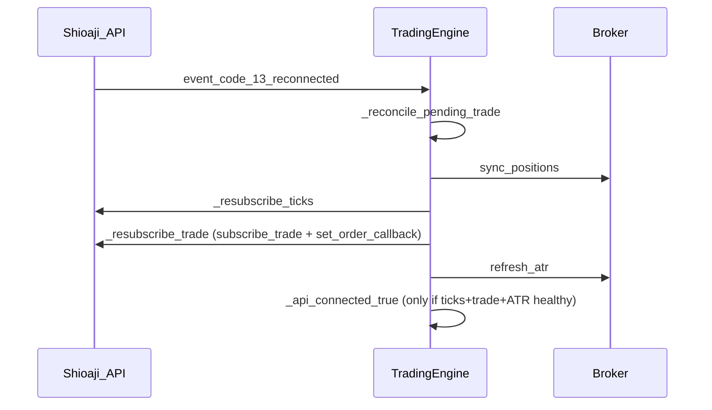

# Live Trading Safety & Failure Modes

This document describes what the kernel does when things go wrong during live operation. It complements [trading-engine SPEC §4.2.2](../../packages/trading-engine/SPEC.md) (invariants) and [trading-engine README](../../packages/trading-engine/README.md) (go-live checklist).

**Scope reminder:** single-direction, full-lot position model for ~1-lot TAIFEX day-session strategies — not general portfolio management.

## How to read this table

| Column | Meaning |
|--------|---------|
| **Scenario** | Real-world failure or edge case |
| **Kernel behavior** | What `TradingEngine` actually does |
| **Expected outcome** | Position / pending / risk state after the event |
| **Operator action** | What you should do in your consuming app |

---

## Failure scenarios

### Session-end disconnect with open position (e.g. 13:43)

| | |
|---|---|
| **Kernel behavior** | At `session_force_flatten_time`, kernel calls `_maybe_kernel_force_flatten` inside `on_tick` lock. If `position_qty > 0` and not already pending exit, it arms a full exit `OrderSignal`. Session watchdog may also trigger relogin on disconnect. |
| **Expected outcome** | If ticks still arrive: forced exit is armed. If disconnected with no ticks: force-flatten cannot fire until reconnect + tick; position may remain open past flatten time. |
| **Operator action** | Ensure `AlertPort` fires on disconnect near session end. Manually flatten via broker UI if kernel cannot tick. Test reconnect + `sync_positions` before go-live. |

**Code:** `engine.py:on_tick`, `order_executor.py:_maybe_kernel_force_flatten`, `engine.py:_check_session_watchdog`

---

### Pending timeout = UNKNOWN → settle → HALT (P0-5, truth-driven)

| | |
|---|---|
| **Kernel behavior** | A `pending_timeout_sec` timeout means the order outcome is **UNKNOWN, not FAILED**. `_check_pending_timeout` does **not** clear pending and let the strategy re-issue. It keeps `pending_order_id` (so a late fill still attributes), tries a fast reconcile, then enters `_settling`: `_settle_via_reconcile` polls `list_positions` and adopts the truth after `reconcile_confirm_reads` consistent reads. A broker-confirmed fill / clean no-fill resolves cleanly (no block). If it cannot be confirmed within `settle_timeout_sec`, the kernel HALTs: `_position_unconfirmed = True` + `block_new_entry = True` + **CRITICAL**, and adopts broker truth. While `_settling` / `_position_unconfirmed`, **both entry and exit are frozen** (`_validate_order_signal` + strategy). |
| **Expected outcome** | No cascade of re-issued orders, no >1-lot accumulation. The kernel either converges to the broker truth or freezes everything pending convergence/operator review. |
| **Operator action** | On a HALT CRITICAL, inspect broker positions; do not assume flat. The kernel auto-converges (see below). Clear `block_new_entry` only after manual reconciliation (restart / next trading-day reset). |

**Code:** `order_executor.py:_check_pending_timeout`, `_settle_via_reconcile`, `_apply_pending_broker_truth`

---

### Convergence flatten while unconfirmed (P0-5)

| | |
|---|---|
| **Kernel behavior** | While `_position_unconfirmed` (HALT) and the broker-adopted position is **not flat**, `_maybe_converge_flatten` sends exactly **one** exit sized to the held qty (throttled by `reconcile_fast_sec`, bypassing the freeze via `_kernel_converging`), then returns to `_settling` to await confirmation. Once confirmed flat, HALT lifts; `block_new_entry` stays set until daily reset / manual clear. |
| **Expected outcome** | A single, correctly-sized flatten brings the position to flat without the strategy ever re-issuing exits. |
| **Operator action** | Watch for `HALT 收斂平倉` logs; confirm the broker reaches flat. Investigate the root cause before re-enabling entries. |

**Code:** `engine.py:_maybe_converge_flatten`, `order_executor.py:_halt_position_unconfirmed`

---

### Periodic broker/kernel position reconcile (P0-3, drift circuit-breaker)

| | |
|---|---|
| **Kernel behavior** | The timeout loop runs `_check_position_reconcile` every `position_reconcile_sec` (default 60, `<=0` disables) during the trading session — or every `reconcile_fast_sec` (default 2) while `_position_unconfirmed` (P0-5). Skipped while pending/settling (those windows are owned by `_settle_via_reconcile`). It reads `list_positions` and compares qty/dir to kernel state. On mismatch: log + CRITICAL alert + `block_new_entry=True`, then adopts broker truth via `sync_positions` and sets `_position_drift_detected`. If `broker_qty > max_position_qty` AND `> kernel_qty`, it escalates to HALT (P0-5) + convergence flatten. A clean reconcile clears the drift flag. |
| **Expected outcome** | Even if a fill callback is lost entirely, kernel state converges to the broker within ~60s and new entries are blocked until manual review. |
| **Operator action** | Treat any `持倉漂移` CRITICAL as a real position discrepancy. Reconcile against the broker before clearing `block_new_entry`. |

**Code:** `engine.py:_check_position_reconcile`, `session.py:read_broker_position`

---

### Position ceiling exceeded (P0-4, `max_position_qty`)

| | |
|---|---|
| **Kernel behavior** | `_validate_order_signal` rejects any **entry** when `position_qty + signal.qty > max_position_qty` (default 1, Pilot). Pending entries are already rejected, so held qty is authoritative. P0-5 adds a hard backstop: if reconcile/settle finds `broker_qty > max_position_qty` AND `> kernel_qty`, the kernel HALTs and converges with a single flatten. |
| **Expected outcome** | Runaway accumulation (the 24-lot / >1-lot failures) is structurally impossible regardless of report-channel health. |
| **Operator action** | Keep `max_position_qty: 1` during Pilot. Raise only with an explicit risk decision. |

**Code:** `order_executor.py:_validate_order_signal`, `config.yaml: operations.max_position_qty`

---

### CA / certificate activation failure

| | |
|---|---|
| **Kernel behavior** | `login()` in live mode requires `SJ_CA_PATH` and `SJ_CA_PASSWD`. `_activate_ca` tries without `person_id`, then with `SJ_CA_PERSON_ID` or account `person_id`. Failure raises `RuntimeError` — login aborts. |
| **Expected outcome** | Engine never reaches `run()` loop; no orders placed. |
| **Operator action** | Verify CA file path, password, and `SJ_CA_PERSON_ID`. Test in simulation first. Never commit cert files (see `.env.example`). |

**Code:** `session.py:login`, `_activate_ca`

---

### Repeated re-login exhaustion

| | |
|---|---|
| **Kernel behavior** | `_check_session_watchdog` retries `api.login` with exponential backoff. After `session_relogin_max_attempts`, sends **CRITICAL** alert and pauses retries for 300s. |
| **Expected outcome** | API may stay disconnected; no new ticks; pending state frozen; open positions unmanaged by kernel until reconnect. |
| **Operator action** | Implement `AlertPort` with paging/Telegram. Monitor broker dashboard. Consider manual flatten if disconnect persists through session end. |

**Code:** `engine.py:_check_session_watchdog`, `handle_session_event`

---

### No-tick watchdog → resubscribe failure

| | |
|---|---|
| **Kernel behavior** | During trading session, if no tick for `no_tick_timeout_sec`, logs warning and calls `_resubscribe_ticks` hook (set by `ShioajiLiveBootstrap`). Throttled to once per 60s. Resubscribe `except` → `_mark_disconnected()` immediately. After `no_tick_resubscribe_escalate_after` consecutive resubscribes (default 3) with no tick recovery → CRITICAL alert + `_mark_disconnected()` → session watchdog `api.login()`. |
| **Expected outcome** | Strategy evaluation stops until ticks resume or relogin succeeds; existing position unchanged; pending orders may timeout separately. |
| **Operator action** | Confirm `ShioajiLiveBootstrap.attach()` wired resubscribe hook. Check API usage limits and contract subscription. If escalation repeats, restart live process. |

**Code:** `engine.py:_check_no_tick_watchdog`, `adapters/shioaji_live.py`

---

### Zombie session after reconnect (SessionNotEstablished)

| | |
|---|---|
| **Symptom** | `ATR 更新失敗` / kbars with `SessionNotEstablished` or `NotReady`; log says `重連後狀態同步完成` but no ticks; no-tick watchdog resubscribes endlessly; `logout` traceback on Ctrl+C. |
| **Kernel behavior (fixed)** | `_on_reconnected` sets `_api_connected=True` **only** when subscribe succeeds and `refresh_atr()` succeeds, or ATR failure is **not** a session error (`api_errors.is_api_session_error`). Session-level ATR/kbars failure → stay disconnected → session watchdog relogin. `run()` finally swallows session-dead `logout` errors. |
| **Expected outcome** | No long-lived “connected but no ticks” state; relogin within ~3 no-tick escalation cycles (~3 min) if resubscribe alone fails. |
| **Operator action** | If relogin exhausts (`session_relogin_max_attempts`), stop process and check network / duplicate API login. |

**Code:** `engine.py:_on_reconnected`, `api_errors.py`, `engine.py:run`

---

### Shioaji `OrderState` mis-routed callbacks (pending timeout with live API)

| | |
|---|---|
| **Symptom** | `下單 ... \| trade=` empty; `RAW_ORDER_EVT OrderState.FuturesOrder` appears in log; **no** `委託回報` / `FILL_AUDIT`; after `pending_timeout_sec` → `Pending 超時 8s 且補查無結果` + CRITICAL; `sync_positions` may show flat even though broker UI shows fills. |
| **Root cause** | Live Shioaji passes `OrderState.FuturesOrder` / `FuturesDeal` as callback `stat`. That type is **str-like** (`isinstance(stat, str)` is `True`) but `stat != "FuturesOrder"`. If `normalize_order_stat` checks `isinstance(stat, str)` **before** `.name`, `is_futures_order()` / `is_futures_deal()` never match → `handle_order_event` ignores all live order callbacks. Mock/backtest pass plain strings `"FuturesOrder"` / `"FuturesDeal"`, so unit tests stay green. |
| **Kernel behavior (fixed)** | `core/order_events.py`: prefer `stat.name` when present, then plain `str`, then `str(stat)`. Regression: `tests/test_order_events.py` (requires `shioaji` installed). |
| **Simulation note** | (P1-2, 2026-06-25) `_reconcile_pending_trade` no longer pure-short-circuits in simulation. It now reconciles against the broker position snapshot (`list_positions`): if the broker already reflects the pending order's outcome it resolves cleanly instead of falsely timing out + circuit-breaking. Only an **unreadable** broker falls through to the timeout path. |
| **Operator / dev action** | UAT: `DUMP_ORDER_EVENTS=1 python -m live.order_smoke` (`apps/trading-app`). Expect `委託回報` → `pending_armed` → `成交回報` → `FILL_AUDIT`. Official Shioaji pattern: compare `stat == sj.OrderState.FuturesOrder` or use `.name`, not `isinstance(stat, str)`. |

**Code:** `core/order_events.py`, `order_executor.py:handle_order_event`, `tests/test_order_events.py`

---

### Order/deal report channel lost after reconnect → phantom position accumulation (24-lot RCA, 2026-06-25)

| | |
|---|---|
| **Symptom** | Overnight/relogin happened; quote ticks kept flowing and the strategy kept entering, but **no** `委託回報` / `FILL_AUDIT` arrived and every order hit `pending_timeout`. Because the kernel believed nothing filled, it re-entered repeatedly. At next-day login `position_sync` revealed **24 short lots** the kernel never tracked. A later stop/exit only flattened **1 lot**, orphaning the other 23. |
| **Root cause (3 layers)** | **A (primary):** reconnect/relogin re-subscribed only quote ticks (`_resubscribe_ticks`), never the trade channel — `subscribe_trade` / `set_order_callback` ran only once at startup. Fills delivered silently. **B:** after a pending timed out and was cleared, a late/orphan deal callback was silently dropped (no position update, no `FILL_AUDIT`). **C:** sim reconcile short-circuited; `sync_positions` failure only warned; no periodic reconcile; `block_new_entry` cleared on restart. Separate exit bug: `manage_exit` sent qty=1 and the exit fill blanket-zeroed `position_qty`, leaving residual lots unmanaged. |
| **Kernel behavior (fixed)** | **P0-1** `_on_reconnected` (and watchdog relogin via it) now calls `_resubscribe_trade` → re-`subscribe_trade` + re-`set_order_callback`; failure degrades the session to unhealthy → relogin. **P0-2** orphan/unattributable deals trigger `sync_positions` + `block_new_entry` + CRITICAL instead of being dropped. **P0-3** `_check_position_reconcile` runs every `position_reconcile_sec` (default 60) during the session; broker/kernel mismatch adopts broker truth + `block_new_entry` + CRITICAL. **P0-4** `max_position_qty` (default 1) hard-rejects entries that would exceed the ceiling. **P1-1** exit fills reduce `position_qty` by the filled amount and only go Flat at zero, then re-sync to confirm the broker is truly flat; kernel sizes exits to the actual held qty. |
| **Expected outcome** | Lost report channel is restored on reconnect; silent fills become impossible to ignore (forced reconcile + block); position can never run away past `max_position_qty`; exits fully flatten or keep tracking the residual. |
| **Operator action** | On any CRITICAL `持倉漂移` / `孤兒成交` / pending-timeout alert: inspect broker positions immediately, do **not** assume flat, and clear `block_new_entry` only after manual reconciliation. UAT: force a relogin, then place an order and confirm `委託回報` → `FILL_AUDIT` still arrive. |

**Code:** `engine.py:_on_reconnected`, `_check_position_reconcile`, `adapters/shioaji_live.py:resubscribe_trade`, `order_executor.py:_handle_futures_deal`, `_apply_deal_fill`, `_validate_order_signal`

---

### ATR / trend refresh persistent failure

| | |
|---|---|
| **Kernel behavior** | `refresh_atr` runs in a daemon thread. Failure logs `ATR 更新失敗` warning; **last known** `current_atr` / `trend_dir` retained. `last_atr_refresh` advances **only on success**; failures retry on a shorter interval. `RiskGate.atr_stale=True` when age > `atr_refresh_sec × atr_stale_multiplier` (default 2×). Strategy blocks **new entry** when stale; exits still allowed. |
| **Expected outcome** | Stale periods: no new entries; open positions still managed. |
| **Operator action** | Monitor `ATR(20) 更新` log cadence. Investigate kbars API failures if stale persists. |

**Code:** `engine.py:refresh_atr`, `_maybe_refresh_atr`, `_is_atr_stale`

---

### Reconnect warmup (P4-13)

| | |
|---|---|
| **Kernel behavior** | After successful `_on_reconnected` (subscribe + session-healthy `refresh_atr()`), sets `_pending_reconnect_warmup=True`. On the **first post-reconnect tick**, `reconnect_warmup_until_ts = tick_ts + reconnect_warmup_sec` (default 300s) so long disconnects still get a full warmup window. `RiskGate.reconnect_warmup_active` blocks **new entry** until exchange tick ts passes warmup end. Exits / force-flatten still allowed. |
| **Expected outcome** | No momentum entries on partially-filled VWAP/ATR windows immediately after reconnect. |
| **Operator action** | UAT: manual disconnect 30–60s; confirm no entry during warmup log line window. |

**Code:** `engine.py:_on_reconnected`, `_is_reconnect_warmup_active`

---

### Repeated disconnects (P4-13)

| | |
|---|---|
| **Kernel behavior** | Each connected→disconnected transition increments `_disconnect_count_today`. At `max_disconnects_per_day` (default 3): `block_new_entry=True` until trading-day reset + CRITICAL alert. Disconnect with open position sends CRITICAL alert when `alert_on_disconnect_with_position=true`. |
| **Expected outcome** | Choppy network days stop new risk after threshold; operator notified on position + disconnect. |
| **Operator action** | Fix network; do not clear `block_new_entry` until day rollover without manual override. |

**Code:** `engine.py:_mark_disconnected`, `order_executor.py:_reset_daily_state`

---

### Multiple open positions on same contract (mixed directions)

| | |
|---|---|
| **Kernel behavior** | `sync_positions` takes **first** matching non-zero position for the contract. Does not net multiple legs. Unmatched positions log warning only. (P1-1) An exit fill reduces `position_qty` by the filled amount and only flips to Flat at zero, then re-syncs to confirm the broker is truly flat; the kernel sizes exits to the actual held qty so a single exit can fully flatten an accumulated position. |
| **Expected outcome** | Kernel state may not reflect full broker exposure for mixed-direction manual legs, but an exit no longer falsely self-reports flat while lots remain at the broker. |
| **Operator action** | Avoid manual trades outside kernel on the same contract. Flatten manually before restart if state is ambiguous. |

**Code:** `session.py:sync_positions`

---

### Reconnect: `trailing_peak` calibration delayed

| | |
|---|---|
| **Kernel behavior** | After `sync_positions` with `force_resync`, sets `_resynced_position = True` and `trailing_peak = entry_price`. First post-resync tick calls `_calibrate_trailing_peak_after_resync`. |
| **Expected outcome** | Trailing stop may be conservative until first tick; one-tick window of suboptimal peak. |
| **Operator action** | Expect slightly wider trailing right after reconnect. Avoid restarting during fast markets if trailing is critical. |

**Code:** `session.py:sync_positions`, `engine.py:on_tick`, `order_executor.py:_update_trailing_peak`

---

### Invalid strategy `OrderSignal` (qty ≤ 0, bad intent, etc.)

| | |
|---|---|
| **Kernel behavior** | `_validate_order_signal` rejects before `_arm_pending`; logs warning; signal discarded for that tick. |
| **Expected outcome** | No order armed; state unchanged. |
| **Operator action** | Fix strategy plugin. Add unit tests for signal shape. See [trading-engine SPEC §4.2](../../packages/trading-engine/SPEC.md). |

**Code:** `order_executor.py:_validate_order_signal`, `engine.py:on_tick`

---

### Direct mutation of engine state (telemetry / strategy bug)

| | |
|---|---|
| **Kernel behavior** | No protection — Python attributes are public. External writes can break invariants (double entry, wrong qty, stuck pending). |
| **Expected outcome** | Undefined behavior; tests will not cover your mutation path. |
| **Operator action** | **Never** assign to `engine.position_qty`, `engine.is_pending`, etc. Use `get_state_snapshot()` for read-only observation only. |

**Code:** `engine.py:get_state_snapshot`, [trading-engine SPEC §4.2.2](../../packages/trading-engine/SPEC.md)

---

## Reconnect sequence (reference)



> **P0-1 (2026-06-25):** `_resubscribe_trade` is the critical step that was previously missing. A reconnect/relogin used to restore only quote ticks; the order/deal report channel stayed dead, so the broker filled silently while the kernel timed out and re-entered — the root cause of the 24-lot phantom short. If `_resubscribe_trade` fails, the session is marked unhealthy and degrades to the watchdog relogin path.

---

## Telemetry: safe snapshot + CRITICAL alert

觀察狀態請用 snapshot，勿讀寫 engine 屬性；嚴重事件透過 `AlertPort` 往外送：

```python
def on_tick_observed(engine, alerts):
    snap = engine.get_state_snapshot()
    if not snap.api_connected and snap.has_position:
        alerts.send(
            f"斷線持倉中 qty={snap.position_qty} dir={snap.position_dir}",
            level="CRITICAL",
        )
    if snap.is_pending:
        # 僅觀察；勿 engine.is_pending = False
        pass
```

Kernel 內建路徑（pending 超時、重登入耗盡等）已會呼叫 `AlertPort.send(..., level="CRITICAL")` — 你的實作需確保這些訊息能送達（Telegram、PagerDuty 等）。

---

## Related documents

- [trading-engine README § Go-Live Checklist](../../packages/trading-engine/README.md)
- [trading-engine SPEC §4.2.2](../../packages/trading-engine/SPEC.md) — kernel invariants
- [trading-engine SPEC §4.2](../../packages/trading-engine/SPEC.md) — strategy author rules