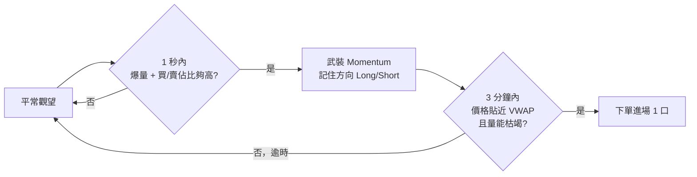

> **Monorepo**：[`tfx-trading`](https://github.com/timhwchuang/tfx-trading) → `packages/strategies/vwap-momentum/`。安裝：`bash scripts/setup-dev.sh`（repo 根）。

# strategy-vwap-momentum

**台指期日內短線策略：量價突破 → 回檔到均價線附近 → 順勢進場；停損 / 停利 / 移動停利出場。**

這是 `trading-engine` 架構下的參考策略 plugin（VWAP momentum pullback 進場 + 可選趨勢 / 結構濾網 + ATR 動態出場）。

**本策略實作為作者個人研究與學習用途而公開，不構成投資建議、交易邀約或獲利保證。** 任何實盤或模擬交易之決策、參數設定、資金配置，以及因此產生的盈虧、漏單或其他損失，**均由使用者自行承擔**。作者與貢獻者不對任何直接或間接損害負責。

> 上實盤（或大規模回測）前請務必：
> 1. 完整閱讀 [docs/ops/LIVE_SAFETY.md](../../../docs/ops/LIVE_SAFETY.md) 與 [docs/uat/KERNEL.md](../../../docs/uat/KERNEL.md)
> 2. 在 simulation / paper trade 跑過完整交易日
> 3. 使用 `engine.get_state_snapshot()` 唯讀觀察狀態，**切勿**直接修改 engine 內部屬性

| 文件 | 用途 |
|------|------|
| **本文 §策略白話解說** | 不看 code 也能懂進出場（給新手） |
| [SPEC.md](SPEC.md) | 完整參數表、決策邏輯細節、audit reason、校準流程 |
| [CHANGELOG.md](../../../CHANGELOG.md#strategy-vwap-momentum) | 版本變更紀錄 |
| [trading-engine SPEC §4.2](../../trading-engine/SPEC.md) | Strategy Protocol MUST / MUST NOT（開發者必讀） |

---

## 策略白話解說（給第一次看的人）

### 這在交易什麼？

- **商品**：微型臺指期貨近月（預設 `TMFR1`；亦支援大台 `TXFR1`、小台 `MXFR1`），**每次最多 1 口**。
- **時段**：日盤約 **08:45～13:45**（交易所時間）；**13:40 後不再開新倉**，**13:44 前強制平掉**所有持倉。
- **風格**：日內短線、順勢。不隔夜。

### 先懂兩個名詞

| 名詞 | 白話 | 本策略怎麼用 |
|------|------|----------------|
| **VWAP 線** | 大家常說的「均價線」；這裡是 **最近 5 分鐘**的成交量加權均價（滾動 VWMA），**不是**從開盤一路累積到收盤的那條日內 VWAP | 價格「回檔貼近」這條線時，才考慮進場 |
| **動量（Momentum）** | 某一秒突然 **爆量**，且買方或賣方明顯佔優 | 代表「有人急著往一個方向打」，策略先 **武裝**，再等價格回來 |

### 核心想法（一句話）

> **先看到「大單往一邊衝」→ 不追價 → 等價格回檔到均價線附近、且量能變小 → 順著原本方向進場。**

很像：人潮先衝進某方向，你等回頭整理到「平均成本」附近，確認不是假突破後再跟上。

### 進場：兩段式（很重要）

程式 **不會** 在爆量當下就下單。分成兩步：



#### 第 1 步：武裝（`momentum_armed`）— 還沒買賣

在 **1 秒鐘** 內同時滿足（預設值）：

| 條件 | 做多（Long） | 做空（Short） |
|------|-------------|---------------|
| 總成交量 | ≥ 150 口（開盤時段會再乘倍率） | 同左 |
| 方向佔比 | 買量 ≥ **80%** | 賣量 ≥ **78%** |
| 其他 | 沒持倉、在交易時段、ATR 夠大（市場有波動） | 同左 |

通過後 log 會出現類似：`MOMENTUM Short 突破 | 價格 47945.0` —— **這只是「開始盯這個方向」，尚未下單。**

武裝後若 **180 秒（3 分鐘）** 內沒等到合適回檔，狀態自動取消（`momentum_timeout`）。

#### 第 2 步：回檔進場（`pullback`）— 真正下單

武裝期間，每一筆 tick 檢查 **兩個條件要同時成立**：

1. **貼近 VWAP**：`|現價 − VWAP| ≤ 2 點`
2. **量能枯竭**：這 1 秒成交量 `≤ 15` 口（爆量後變冷清）

通過 → 依武裝方向下單：**Long 買進 / Short 賣出**，1 口。

> **可選濾網**（預設 **關閉**）：趨勢濾網、SMC 結構濾網。開啟時，回檔條件滿足也可能被擋下（log 會寫 `trend_veto` / `structure_veto`）。UAT 預設不開。

---

## 圖解範例：做空一筆（5 分 K 概念圖）

以下用 **5 分鐘 K 線** 幫助想像；實際程式是 **逐 tick（毫秒級）** 判斷，比 K 線更細。

**假設 VWAP ≈ 47,966，09:50～10:00 走勢：**

```
價格
47980 ┤                    ╭─╮  ← ③ 回檔貼近 VWAP，量能變小 → 放空進場
      │               ╭───╯ ╰──╮
47960 ┤          ╭───╯    VWAP ┈┈┈┈┈┈┈┈┈┈┈┈┈┈┈
      │     ╭───╯
47940 ┤ ───╯  ← ② 爆量下跌，賣盤 81% → 武裝 Short（尚未下單）
      │
47920 ┤
      └────┬────┬────┬────┬────┬──── 時間
         09:50 09:52 09:54 09:56 09:58
              ↑
         ① 平常：不交易
```

| 步驟 | 時間（例） | 發生什麼 | 有沒有下單 |
|------|-----------|----------|-----------|
| ① | 09:50 前 | 價格震盪，沒有夠大的 1 秒爆量 | 無 |
| ② | 09:52 某秒 | 1 秒賣了 150+ 口、賣方佔 81% | **無**（只武裝 Short） |
| ③ | 09:56 某秒 | 價格回到 VWAP 附近（差 ≤2 點），且該秒量 ≤15 | **有**（賣出放空） |

**做多** 把圖上下顛倒即可：爆量 **買方** 武裝 Long → 回檔貼 VWAP → 買進。

---

## 出場：什麼時候平倉？

持倉後，每個 tick 檢查下列條件（**先觸發先出場**）。以下用 **做多、進場價 48,000** 為例（預設參數）：

| 出場類型 | 條件（做多） | 預設距離 | 白話 |
|----------|-------------|----------|------|
| **硬停損** | 現價 ≤ 進場價 − 6 | 6 點 | 「進場就錯了」，認賠 |
| **VWAP 停損** | 現價 ≤ VWAP − 3 | 3 點 | 價格跌回均價線下方太多，趨勢可能反轉 |
| **固定停利** | 現價 ≥ 進場價 + 20 | 20 點 | 賺夠先走 |
| **移動停利** | 從持倉後最高價回落 8 點 | 8 點 | 讓利潤奔跑，回吐一段就出 |
| **收盤強平** | 時間 ≥ 13:44 | — | 日盤結束前一定平倉 |

**做空** 時方向相反（例如硬停損是進場價 **+6**、停利是進場價 **−20**）。

### 進場後的「緩衝期」（Grace）

進場後 **前 30 秒**（或前 60 個 tick，先到為準）：

- **只認硬停損**（±6 點）
- **不認** VWAP 停損

用意：避免剛進場就被 VWAP 線附近的正常抖動洗出去。

### 還沒進場時，什麼情況完全不交易？

- 不在 08:45～13:45 交易時段
- 13:40 後（收盤前禁新單）
- 剛平倉 **10 秒** 冷卻內
- 當日虧損達 **120 點** 上限，或連續虧 **4** 筆
- 市場波動太小（ATR < 25）
- 已有持倉、或上一筆單還在掛單中

---

## 預設參數速查表

數值來自 `apps/trading-app/config/config.yaml`（可依研究調整，調參見 [SPEC.md](SPEC.md)）：

| 類別 | 參數 | 預設 | 意思 |
|------|------|------|------|
| 均價線 | `vwap_window_min` | 5 分鐘 | 滾動 VWAP 視窗 |
| 武裝 | `momentum_vol_1s` | 150 | 1 秒爆量門檻 |
| 武裝 | `momentum_buy_ratio` / `sell_ratio` | 80% / 78% | 買/賣方向佔比 |
| 武裝 | `momentum_timeout_sec` | 180 秒 | 等回檔最久 3 分鐘 |
| 進場 | `entry_band_points` | 2 點 | 多近算「貼 VWAP」 |
| 進場 | `exhaustion_vol` | 15 | 多小算「量能枯竭」 |
| 出場 | `hard_stop_points` | 6 點 | 硬停損 |
| 出場 | `vwap_stop_points` | 3 點 | VWAP 停損距離 |
| 出場 | `fixed_tp_points` | 20 點 | 固定停利 |
| 出場 | `trail_points` | 8 點 | 移動停利回撤 |
| 出場 | `exit_grace_sec` | 30 秒 | 進場後緩衝期 |
| 風控 | `max_daily_loss_points` | 120 點 | 單日虧損上限 |
| 風控 | `cooldown_sec` | 10 秒 | 平倉後冷卻 |
| 時段 | `session_start` / `end` | 08:45 / 13:45 | 可產生信號區間 |
| 時段 | `flatten_time` | 13:40 | 停止新進場 |
| 時段 | `force_flatten_time` | 13:44 | 強制平倉 |

> **1 點** 在台指類期貨為指數 1 點。預設 **微台** 每口約 **10 元/點**（`config.yaml` `point_value_ntd`）；大台約 200 元/點。本文策略參數談「指數點數」，不談保證金。

---

## 開發者指南

以下為安裝、注入 engine、測試與架構說明。若你只想懂策略邏輯，讀到上一節即可。

## Status

**0.1.2** — 參考 strategy plugin；搭配 **trading-engine v0.2.2+**（`atr_stale` / reconnect warmup gates）。

## Install

### Monorepo（建議）

```bash
git clone git@github.com:timhwchuang/tfx-trading.git
cd tfx-trading
bash scripts/setup-dev.sh   # editable install 全部 packages
```

本 package 路徑：`packages/strategies/vwap-momentum/`。

### 單 package 從 monorepo git 安裝（進階）

```bash
pip install "trading-engine @ git+https://github.com/timhwchuang/tfx-trading.git@v0.3.0-monorepo#subdirectory=packages/trading-engine"
pip install "strategy-vwap-momentum @ git+https://github.com/timhwchuang/tfx-trading.git@v0.3.0-monorepo#subdirectory=packages/strategies/vwap-momentum"
```

### 本地開發（已在 monorepo 內）

```bash
cd packages/strategies/vwap-momentum
pip install -e ".[dev]"          # 含 ruff / mypy
# trading-engine 已由 setup-dev.sh 或 pip -e ../../trading-engine 安裝
```

## Usage

### 1. 注入 TradingEngine（live 或 kernel test）

```python
from trading_engine import TradingEngine, RuntimeConfig, Settings
from trading_engine.adapters.shioaji import ShioajiOrderAdapter
from trading_engine.adapters.shioaji_live import ShioajiLiveBootstrap
# ... 其他 ports

from strategy_vwap_momentum import VWAPMomentumStrategy, StrategyParams

settings = Settings(...)          # 你的 app 從 yaml/env 載入
cfg = RuntimeConfig(settings)
strategy = VWAPMomentumStrategy(params=StrategyParams.from_runtime_config(cfg))

engine = TradingEngine(
    api=...,
    strategy=strategy,
    runtime_config=cfg,
    order_adapter=ShioajiOrderAdapter(api=...),
    # telemetry, trend_refresh, alerts, archive ...
)

ShioajiLiveBootstrap(engine).start_live()
```

### 2. 使用 entry point 動態載入（推薦給 CLI / 通用 app）

```python
from importlib.metadata import entry_points

eps = entry_points(group="trading_engine.strategies")
factory = next(ep for ep in eps if ep.name == "vwap_momentum").load()
strategy = factory(params=StrategyParams.from_runtime_config(cfg))
```

trading-engine 也提供 `load_strategy("vwap_momentum", params=...)` 方便函式（見 trading-engine `plugins.py`）。

### 3. Backtest / Replay（與 live 使用完全相同 strategy instance）

由 `trading-backtest` 負責 replay loop 與 MockBroker。你只要把上面建好的 `strategy` 傳給 `BacktestEngine` 即可。

```python
from trading_backtest import BacktestEngine
# ...
bt = BacktestEngine(code="TMFR1", dates=[...], strategy=strategy, runtime_config=cfg, ...)
bt.run()
```

## 參數總覽（StrategyParams）

完整說明與校準建議請見 [SPEC.md](SPEC.md) §4；**白話對照**見上文 §預設參數速查表。

開發者關鍵類別（皆來自 RuntimeConfig overlay，可在 sweep 時動態 patch）：
- 進場：`entry_band_points`、`exhaustion_vol`、`momentum_buy_ratio` / `momentum_sell_ratio`、`min_atr_threshold`
- 出場：`hard_stop_points`、`fixed_tp_points`、`vwap_stop_points` + ATR 動態（`atr_vwap_stop_enabled`、`vwap_stop_*_floor` / `*_atr_k`）
- 移動停損：`trail_points` + ATR 動態 + `exit_grace_*`
- 風險控管：`max_consecutive_loss`
- 濾網（預設關）：`trend_filter_enabled`、`structure_filter_enabled` 等

## 核心行為保證（本策略）

- **兩段式進場**：武裝（爆量）→ 回檔（貼 VWAP + 量縮）才下單；武裝當下不下單。
- Pullback 須同時「貼近 VWAP」**且**「量能枯竭」；可選 trend / structure 濾網（預設關）。
- 出場優先順序與 grace period：grace 內只認 hard stop；grace 後 VWAP stop 才生效。
- ATR 動態 trail / vwap stop：可獨立開關，floor + k 係數控制下限與敏感度。
- Session force flatten：kernel 主導，plugin 可客製 slippage 與 audit reason。
- 冷卻、pending、block_new_entry、daily loss 等 gate **完全尊重** RiskGate（由 trading-engine 計算並傳入）。

詳見 [SPEC.md](SPEC.md) 的決策流程與 trend 語意警告。

## Testing

```bash
python run_tests.py
```

目前約 **27** 個測試（workspace 統計），重點涵蓋：
- trend 數學（EMA warmup、resample 保證最新 bar、slope、ATR normalization、Level-2 min_strength gate）
- 行為邊界：exit grace、cooldown 使用 exchange timestamp、session force flatten、trend veto 正確產生 audit
- 整合風格測試透過 `trading_engine.testing` helpers

CI（見 `.github/workflows/tests.yml`）會安裝指定版本的 trading-engine 後執行，並跑 ruff + mypy。

## Architecture

```
strategy_vwap_momentum/
├── __init__.py                 # 公開 surface + __version__
├── strategy.py                 # VWAPMomentumStrategy（evaluate / manage_exit / audit）
├── params.py                   # StrategyParams + sweep / patch 工具
└── trend.py                    # compute_trend + dynamic ATR helpers + trend_allows_entry（純函式）
```

- 決策完全不依賴全域狀態或 broker。
- 所有可調參數走 `RuntimeConfig` overlay，方便參數 sweep 與 A/B 校準。
- Momentum 狀態（`active`、`direction`、`trigger_time`）**嚴格留在 plugin 內**（`peak` 為歷史死碼，已移除），不洩漏到 Protocol。

## 版本

```python
import strategy_vwap_momentum
print(strategy_vwap_momentum.__version__)  # 0.1.0
```

與 trading-engine 版本策略對齊（0.x 期間 API 仍可能微調）。

## 延伸與貢獻

本 package 同時作為未來 `strategy-starter` 模板的參考來源。如果你想開發自己的策略：

1. 實作 `trading_engine.core.strategy.BaseStrategy`（或直接 `Strategy` Protocol）
2. 只 import trading-engine 公開的 core types / Strategy / SignalAudit
3. 提供自己的 entry point
4. 寫純單元測試（mock MarketSnapshot 等）

歡迎在 trading-engine / 本 repo 提出 issue 討論 Protocol 演進或參數校準經驗。

## License

MIT — see [LICENSE](LICENSE).

---

**再次提醒**：這是研究參考實作。請在 simulation / paper 階段充分驗證，並嚴格遵守 trading-engine 的安全守則與 UAT 流程。作者不承擔任何交易損失責任。
